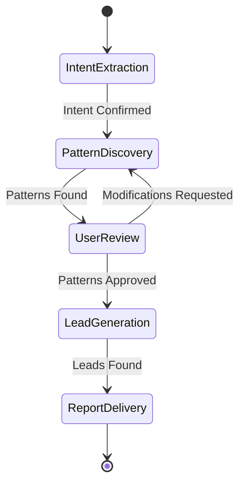

# Design Document

## Overview

The Deep Research Lead Generation Agent is a hierarchical multi-agent system built on Google's Agent Development Kit (ADK). The architecture employs a primary orchestrator pattern with specialized sub-agents organized into two major workflows: Pattern Discovery and Lead Generation. The system leverages parallel execution for efficiency and maintains conversational state across multiple user interactions.

The design philosophy centers on decomposition of complex tasks into discrete, manageable phases executed by specialized agents, with a root agent coordinating the overall workflow and user interaction.

## Architecture

### High-Level Architecture

The system follows a hierarchical multi-agent architecture with three tiers:

**Tier 1: Root Orchestrator** - Manages user interaction and workflow coordination
**Tier 2: Workflow Agents** - Execute multi-step processes (Pattern Discovery & Lead Generation)
**Tier 3: Specialized Workers** - Perform specific tasks (finding, validating, analyzing)

```
┌─────────────────────────────────────────────────────────────────────────┐
│                              USER INTERFACE                             │
│                    (Natural Language Conversation)                      │
└────────────────────────────────┬────────────────────────────────────────┘
                                 │
                                 ↕
┌─────────────────────────────────────────────────────────────────────────┐
│                    ROOT AGENT (Tier 1)                                  │
│                  InteractiveLeadGenerator                               │
│                                                                          │
│  Functionality:                                                          │
│  • Manages conversation flow and session state                          │
│  • Routes requests to appropriate workflows                             │
│  • Handles user confirmations and modifications                         │
│  • Coordinates stage transitions (Intent → Discovery → Review → Leads)  │
└──────────────┬──────────────────────────────────────┬───────────────────┘
               │                                      │
               ↓                                      ↓
    ┌──────────────────┐                  ┌──────────────────────┐
    │ Intent Extractor │                  │   User Interaction   │
    │     Agent        │                  │        Tool          │
    │                  │                  │                      │
    │ Functionality:   │                  │ Functionality:       │
    │ • Parse natural  │                  │ • Get user choices   │
    │   language input │                  │ • Confirm decisions  │
    │ • Extract:       │                  │ • Request approvals  │
    │   - Industry     │                  └──────────────────────┘
    │   - Country      │
    │   - Intent       │
    │   - Criteria     │
    └──────────────────┘
               │
               ↓
┌─────────────────────────────────────────────────────────────────────────┐
│              PATTERN DISCOVERY WORKFLOW (Tier 2)                        │
│                    Sequential Agent                                     │
│                                                                          │
│  Purpose: Analyze successful companies to identify success patterns     │
└─────────────────────────────────────────────────────────────────────────┘
               │
               ↓
    ┌──────────────────────────────────────────────────────────┐
    │  Step 1: Company Finder Agent                            │
    │                                                           │
    │  Functionality:                                           │
    │  • Search for 10-15 successful companies                 │
    │  • Filter by industry and country                        │
    │  • Focus on market leaders with proven track records     │
    │  • Gather: name, description, success factors, website   │
    └──────────────────────┬───────────────────────────────────┘
                           ↓
    ┌──────────────────────────────────────────────────────────┐
    │  Step 2: Company Formatter Agent                         │
    │                                                           │
    │  Functionality:                                           │
    │  • Standardize raw company data                          │
    │  • Normalize formats and structures                      │
    │  • Remove duplicates                                     │
    │  • Enrich with metadata                                  │
    │  • Output: List[CompanyData]                             │
    └──────────────────────┬───────────────────────────────────┘
                           ↓
    ┌──────────────────────────────────────────────────────────┐
    │  Step 3: Research Orchestrator Agent                     │
    │                                                           │
    │  Functionality:                                           │
    │  • Manage PARALLEL validation of all companies           │
    │  • Coordinate async execution                            │
    │  • Aggregate validation results                          │
    │  • Handle failures gracefully                            │
    └──────────────────────┬───────────────────────────────────┘
                           │
            ┌──────────────┼──────────────┐
            ↓              ↓              ↓
    ┌──────────────┐ ┌──────────────┐ ┌──────────────┐
    │  Validator   │ │  Validator   │ │  Validator   │
    │  Agent (1)   │ │  Agent (2)   │ │  Agent (N)   │
    │              │ │              │ │              │
    │ Shared Agent │ │ Shared Agent │ │ Shared Agent │
    │              │ │              │ │              │
    │ Validates:   │ │ (Parallel    │ │ (Parallel    │
    │ • Legitimacy │ │  Execution)  │ │  Execution)  │
    │ • Industry   │ │              │ │              │
    │ • Location   │ │              │ │              │
    │ • Data       │ │              │ │              │
    │ • Success    │ │              │ │              │
    │              │ │              │ │              │
    │ Returns:     │ │              │ │              │
    │ • is_valid   │ │              │ │              │
    │ • score 0-1  │ │              │ │              │
    │ • details    │ │              │ │              │
    │ • reasons    │ │              │ │              │
    └──────┬───────┘ └──────┬───────┘ └──────┬───────┘
           └────────────────┼────────────────┘
                           ↓
    ┌──────────────────────────────────────────────────────────┐
    │  Step 4: Synthesizer Orchestrator Agent                  │
    │                                                           │
    │  Functionality:                                           │
    │  • Consolidate all validation results                    │
    │  • Filter valid companies                                │
    │  • Aggregate data for pattern analysis                   │
    │  • Structure for synthesis                               │
    └──────────────────────┬───────────────────────────────────┘
                           ↓
    ┌──────────────────────────────────────────────────────────┐
    │  Step 5: Pattern Synthesizer Agent                       │
    │                                                           │
    │  Functionality:                                           │
    │  • Identify common success patterns across companies     │
    │  • Calculate pattern frequency and confidence            │
    │  • Provide evidence and source citations                 │
    │  • Generate PatternReport with:                          │
    │    - Pattern descriptions                                │
    │    - Confidence scores                                   │
    │    - Supporting companies                                │
    │    - Evidence and sources                                │
    └──────────────────────┬───────────────────────────────────┘
                           │
                           ↓
                  ┌────────────────┐
                  │  USER REVIEW   │
                  │  & APPROVAL    │
                  └────────┬───────┘
                           │
                           ↓
┌─────────────────────────────────────────────────────────────────────────┐
│              LEAD GENERATION WORKFLOW (Tier 2)                          │
│                    Sequential Agent                                     │
│                                                                          │
│  Purpose: Find and analyze potential leads matching success patterns    │
└─────────────────────────────────────────────────────────────────────────┘
               │
               ↓
    ┌──────────────────────────────────────────────────────────┐
    │  Step 1: Lead Finder Agent                               │
    │                                                           │
    │  Functionality:                                           │
    │  • Search for companies matching discovered patterns     │
    │  • Use pattern-based query construction                  │
    │  • Find emerging/growing companies                       │
    │  • Gather raw lead data                                  │
    └──────────────────────┬───────────────────────────────────┘
                           ↓
    ┌──────────────────────────────────────────────────────────┐
    │  Step 2: Lead Formatter Agent                            │
    │                                                           │
    │  Functionality:                                           │
    │  • Standardize lead data                                 │
    │  • Calculate match scores against patterns               │
    │  • Tag matching patterns                                 │
    │  • Add discovery source metadata                         │
    │  • Output: List[LeadData]                                │
    └──────────────────────┬───────────────────────────────────┘
                           ↓
    ┌──────────────────────────────────────────────────────────┐
    │  Step 3: Lead Research Orchestrator Agent                │
    │                                                           │
    │  Functionality:                                           │
    │  • Manage PARALLEL dual-agent analysis per lead          │
    │  • Run Validator + Signal Analyzer simultaneously        │
    │  • Coordinate async execution for all leads              │
    │  • Aggregate analysis results                            │
    └──────────────────────┬───────────────────────────────────┘
                           │
            ┌──────────────┼──────────────┐
            ↓              ↓              ↓
    ┌──────────────┐ ┌──────────────┐ ┌──────────────┐
    │   LEAD 1     │ │   LEAD 2     │ │   LEAD N     │
    │   PIPELINE   │ │   PIPELINE   │ │   PIPELINE   │
    │              │ │              │ │              │
    │ ┌──────────┐ │ │ (Parallel    │ │ (Parallel    │
    │ │Validator │ │ │  Execution)  │ │  Execution)  │
    │ │  Agent   │ │ │              │ │              │
    │ └────┬─────┘ │ │              │ │              │
    │      │       │ │              │ │              │
    │ ┌────▼─────┐ │ │              │ │              │
    │ │ Signal   │ │ │              │ │              │
    │ │ Analyzer │ │ │              │ │              │
    │ │  Agent   │ │ │              │ │              │
    │ └──────────┘ │ │              │ │              │
    │              │ │              │ │              │
    │ Analyzes:    │ │              │ │              │
    │ • Growth     │ │              │ │              │
    │ • Market     │ │              │ │              │
    │ • Tech       │ │              │ │              │
    │ • Customers  │ │              │ │              │
    │ • Risks      │ │              │ │              │
    │              │ │              │ │              │
    │ Returns:     │ │              │ │              │
    │ • Signals    │ │              │ │              │
    │ • Strength   │ │              │ │              │
    │ • Growth     │ │              │ │              │
    │ • Risks      │ │              │ │              │
    │ • Score 0-1  │ │              │ │              │
    └──────┬───────┘ └──────┬───────┘ └──────┬───────┘
           └────────────────┼────────────────┘
                           ↓
    ┌──────────────────────────────────────────────────────────┐
    │  Step 4: Report Orchestrator Agent                       │
    │                                                           │
    │  Functionality:                                           │
    │  • Consolidate all analysis results                      │
    │  • Rank leads by priority (high/medium)                  │
    │  • Group by pattern matches                              │
    │  • Filter and organize data                              │
    └──────────────────────┬───────────────────────────────────┘
                           ↓
    ┌──────────────────────────────────────────────────────────┐
    │  Step 5: Report Compiler Agent                           │
    │                                                           │
    │  Functionality:                                           │
    │  • Generate comprehensive lead report                    │
    │  • Create executive summary                              │
    │  • Prioritize leads (high/medium)                        │
    │  • Provide pattern match analysis                        │
    │  • Generate actionable recommendations                   │
    │  • Document methodology                                  │
    │                                                           │
    │  Output: LeadReport with:                                │
    │  • Executive summary                                     │
    │  • High priority leads (detailed)                        │
    │  • Medium priority leads                                 │
    │  • Pattern analysis                                      │
    │  • Recommendations                                       │
    └──────────────────────┬───────────────────────────────────┘
                           │
                           ↓
                  ┌────────────────┐
                  │  FINAL REPORT  │
                  │   DELIVERED    │
                  └────────────────┘
```

### Agent Functionality Summary

| Agent | Tier | Type | Key Functionality |
|-------|------|------|-------------------|
| **InteractiveLeadGenerator** | 1 | Root | Conversation management, workflow routing, state coordination |
| **Intent Extractor** | 3 | Worker | Parse user input → structured data (industry, country, intent) |
| **Company Finder** | 3 | Worker | Search & identify 10-15 successful companies in target market |
| **Company Formatter** | 3 | Worker | Standardize, normalize, deduplicate company data |
| **Research Orchestrator** | 2 | Orchestrator | Manage parallel validation of companies |
| **Validator** | 3 | Shared Worker | Verify legitimacy, accuracy, completeness (score 0-1) |
| **Synthesizer Orchestrator** | 2 | Orchestrator | Consolidate validation results |
| **Pattern Synthesizer** | 3 | Worker | Identify success patterns with evidence & confidence scores |
| **Lead Finder** | 3 | Worker | Search companies matching discovered patterns |
| **Lead Formatter** | 3 | Worker | Standardize leads, calculate match scores |
| **Lead Research Orchestrator** | 2 | Orchestrator | Manage parallel dual-agent analysis (Validator + Analyzer) |
| **Signal Analyzer** | 3 | Worker | Detect growth signals, risks, market positioning |
| **Report Orchestrator** | 2 | Orchestrator | Consolidate & rank analysis results |
| **Report Compiler** | 3 | Worker | Generate comprehensive lead report with recommendations |

### Agent Hierarchy

The system follows a three-tier hierarchy:

1. **Tier 1 - Root Orchestrator**: InteractiveLeadGenerator manages the entire workflow
2. **Tier 2 - Workflow Orchestrators**: SequentialAgents that coordinate multi-step processes
3. **Tier 3 - Specialized Workers**: Individual agents performing specific tasks

### Workflow State Machine

```
    START
      │
      ▼
┌─────────────────┐
│     Intent      │
│   Extraction    │
└────────┬────────┘
         │ Intent Confirmed
         ▼
┌─────────────────┐
│    Pattern      │
│   Discovery     │
└────────┬────────┘
         │ Patterns Found
         ▼
┌─────────────────┐
│  User Review    │◄──┐
│  & Approval     │   │
└────┬───────┬────┘   │
     │       │         │
     │       └─────────┘
     │    Modifications
     │     Requested
     │
     │ Patterns Approved
     ▼
┌─────────────────┐
│      Lead       │
│   Generation    │
└────────┬────────┘
         │ Leads Found
         ▼
┌─────────────────┐
│     Report      │
│    Delivery     │
└────────┬────────┘
         │
         ▼
       END
```

**Mermaid Diagram** (for tools that support it):


## Components and Interfaces

### 1. Root Agent (InteractiveLeadGenerator)

**Purpose**: Primary orchestrator managing workflow, user interaction, and state

**Configuration**:
```python
Agent(
    name="InteractiveLeadGenerator",
    model=os.getenv("GEN_ADVANCED_MODEL", "gemini-2.5-pro"),
    instruction=ROOT_AGENT_INSTRUCTION,
    tools=[get_user_choice, *agent_tools],
    before_agent_callback=[before_agent_run],
    after_tool_callback=[after_tool_run]
)
```

**Responsibilities**:
- Interpret user requests and maintain conversation context
- Delegate to specialized workflows via AgentTools
- Manage session state through callbacks
- Request user confirmation at decision points
- Coordinate transitions between workflow phases

**Interface**:
- Input: User natural language requests
- Output: Conversational responses, workflow results
- Tools: get_user_choice, PatternDiscoveryAgentTool, LeadGenerationAgentTool

### 2. Intent Extractor Agent

**Purpose**: Parse user input into structured parameters

**Configuration**:
```python
LlmAgent(
    name="intent_extractor_agent",
    model=os.getenv("GEN_FAST_MODEL", "gemini-2.5-flash"),
    instruction=INTENT_EXTRACTOR_PROMPT,
    output_schema=IntentExtractionResult
)
```

**Data Model**:
```python
class IntentExtractionResult:
    industry: str
    country: str
    user_intent: str
    additional_criteria: Optional[Dict[str, Any]]
```

**Interface**:
- Input: Raw user text
- Output: IntentExtractionResult object
- Validation: Schema-enforced structured output

### 3. Pattern Discovery Workflow

**Purpose**: Analyze successful companies to identify patterns

**Architecture**: SequentialAgent with 5 sub-agents

**Configuration**:
```python
SequentialAgent(
    name="PatternDiscoveryAgent",
    sub_agents=[
        company_finder_agent,
        company_formatter_agent,
        research_orchestrator_agent,
        synthesizer_orchestrator_agent,
        pattern_synthesizer_agent
    ]
)
```

#### 3.1 Company Finder Agent

**Purpose**: Search for companies matching user criteria

**Interface**:
- Input: IntentExtractionResult (industry, country)
- Output: List of raw company data
- Tools: Web search, company databases, API integrations

**Search Strategy**:
- Query construction based on industry + country
- Multiple source aggregation
- Initial filtering for relevance

#### 3.2 Company Formatter Agent

**Purpose**: Standardize raw company data

**Data Model**:
```python
class CompanyData:
    name: str
    industry: str
    country: str
    website: Optional[str]
    description: Optional[str]
    metadata: Dict[str, Any]
```

**Interface**:
- Input: Raw company data (various formats)
- Output: List[CompanyData]
- Transformation: Normalization, deduplication, enrichment

#### 3.3 Research Orchestrator Agent

**Purpose**: Manage parallel validation of companies

**Parallel Execution Pattern**:
```python
# Pseudo-code for parallel execution
async def orchestrate_research(companies: List[CompanyData]):
    validation_tasks = [
        validate_company(company) for company in companies
    ]
    results = await asyncio.gather(*validation_tasks)
    return results
```

**Interface**:
- Input: List[CompanyData]
- Output: List[ValidationResult]
- Concurrency: Parallel execution of validation pipelines

#### 3.4 Validator Agent (Reusable)

**Purpose**: Scrutinize companies against strict criteria

**Validation Criteria**:
- Business legitimacy verification
- Industry classification accuracy
- Geographic location confirmation
- Data completeness assessment
- Success indicators presence

**Data Model**:
```python
class ValidationResult:
    company: CompanyData
    is_valid: bool
    validation_score: float
    validation_details: Dict[str, Any]
    rejection_reasons: Optional[List[str]]
```

**Interface**:
- Input: CompanyData
- Output: ValidationResult
- Tools: Web verification, database lookups, API calls

#### 3.5 Synthesizer Orchestrator Agent

**Purpose**: Consolidate validated data

**Interface**:
- Input: List[ValidationResult]
- Output: ConsolidatedResearchData
- Processing: Filtering, aggregation, structuring

#### 3.6 Pattern Synthesizer Agent

**Purpose**: Identify common success patterns

**Analysis Approach**:
- Cross-company pattern detection
- Statistical significance assessment
- Evidence-based synthesis
- Source citation tracking

**Data Model**:
```python
class SuccessPattern:
    pattern_id: str
    description: str
    frequency: int
    confidence_score: float
    supporting_companies: List[str]
    evidence: List[str]
    sources: List[str]
```

**Interface**:
- Input: ConsolidatedResearchData
- Output: PatternReport (List[SuccessPattern])

### 4. Lead Generation Workflow

**Purpose**: Find potential leads matching discovered patterns

**Architecture**: SequentialAgent with 5 sub-agents

**Configuration**:
```python
SequentialAgent(
    name="LeadGenerationAgent",
    sub_agents=[
        lead_finder_agent,
        lead_formatter_agent,
        lead_research_orchestrator_agent,
        report_orchestrator_agent,
        report_compiler_agent
    ]
)
```

#### 4.1 Lead Finder Agent

**Purpose**: Search for companies matching success patterns

**Interface**:
- Input: PatternReport
- Output: List of raw lead data
- Search Strategy: Pattern-based query construction

#### 4.2 Lead Formatter Agent

**Purpose**: Standardize lead data

**Data Model**:
```python
class LeadData:
    company: CompanyData
    match_score: float
    matching_patterns: List[str]
    discovery_source: str
```

**Interface**:
- Input: Raw lead data
- Output: List[LeadData]

#### 4.3 Lead Research Orchestrator Agent

**Purpose**: Manage parallel analysis of leads

**Parallel Execution Pattern**:
```python
# Pseudo-code for parallel dual-agent execution
async def orchestrate_lead_research(leads: List[LeadData]):
    analysis_tasks = [
        analyze_lead(lead) for lead in leads
    ]
    results = await asyncio.gather(*analysis_tasks)
    return results

async def analyze_lead(lead: LeadData):
    # Run validator and analyzer in parallel
    validation, signals = await asyncio.gather(
        validator_agent.run(lead),
        signal_analyzer_agent.run(lead)
    )
    return LeadAnalysisResult(lead, validation, signals)
```

**Interface**:
- Input: List[LeadData]
- Output: List[LeadAnalysisResult]
- Concurrency: Parallel execution with dual sub-agents per lead

#### 4.4 Lead Signal Analyzer Agent

**Purpose**: Identify specific success signals in leads

**Analysis Dimensions**:
- Pattern match strength
- Growth indicators
- Market positioning
- Competitive advantages
- Risk factors

**Data Model**:
```python
class SignalAnalysis:
    lead: LeadData
    detected_signals: List[str]
    signal_strength: Dict[str, float]
    growth_indicators: List[str]
    risk_factors: List[str]
    recommendation_score: float
```

**Interface**:
- Input: LeadData
- Output: SignalAnalysis

#### 4.5 Report Orchestrator Agent

**Purpose**: Consolidate analysis results

**Interface**:
- Input: List[LeadAnalysisResult]
- Output: ConsolidatedLeadData
- Processing: Ranking, filtering, grouping

#### 4.6 Report Compiler Agent

**Purpose**: Generate comprehensive lead report

**Report Structure**:
```python
class LeadReport:
    executive_summary: str
    total_leads_found: int
    high_priority_leads: List[LeadAnalysisResult]
    medium_priority_leads: List[LeadAnalysisResult]
    pattern_match_analysis: Dict[str, Any]
    recommendations: List[str]
    methodology_notes: str
```

**Interface**:
- Input: ConsolidatedLeadData
- Output: LeadReport

### 5. State Management System

**Purpose**: Maintain context across agent turns

**Session State Structure**:
```python
class SessionState:
    session_id: str
    current_stage: str  # 'intent', 'pattern_discovery', 'review', 'lead_generation'
    intent_data: Optional[IntentExtractionResult]
    pattern_report: Optional[PatternReport]
    lead_report: Optional[LeadReport]
    conversation_history: List[Dict[str, Any]]
    metadata: Dict[str, Any]
```

**Callback Architecture**:

```python
def before_agent_run(agent_context):
    """Initialize or restore session state"""
    session_id = agent_context.get_session_id()
    state = load_or_create_session(session_id)
    agent_context.set_state(state)
    return agent_context

def after_tool_run(tool_result, agent_context):
    """Update state based on tool execution"""
    state = agent_context.get_state()
    
    # Update stage based on tool completion
    if tool_result.tool_name == "PatternDiscoveryAgent":
        state.current_stage = "review"
        state.pattern_report = tool_result.output
    elif tool_result.tool_name == "LeadGenerationAgent":
        state.current_stage = "complete"
        state.lead_report = tool_result.output
    
    save_session(state)
    return tool_result
```

### 6. AgentTool Abstraction Layer

**Purpose**: Wrap SequentialAgents as callable tools

**Implementation**:
```python
from google.adk.tools import AgentTool

agent_tools = [
    AgentTool(agent=pattern_discovery_agent),
    AgentTool(agent=lead_generation_agent)
]
```

**Interface Contract**:
- Input: Workflow-specific parameters
- Output: Consolidated workflow results
- Execution: Synchronous invocation of entire sub-agent sequence
- Error Handling: Propagate failures to root agent

## Data Models

### Core Data Structures

```python
# Intent Extraction
class IntentExtractionResult:
    industry: str
    country: str
    user_intent: str
    additional_criteria: Optional[Dict[str, Any]]

# Company Data
class CompanyData:
    name: str
    industry: str
    country: str
    website: Optional[str]
    description: Optional[str]
    metadata: Dict[str, Any]

# Validation
class ValidationResult:
    company: CompanyData
    is_valid: bool
    validation_score: float
    validation_details: Dict[str, Any]
    rejection_reasons: Optional[List[str]]

# Pattern Discovery
class SuccessPattern:
    pattern_id: str
    description: str
    frequency: int
    confidence_score: float
    supporting_companies: List[str]
    evidence: List[str]
    sources: List[str]

class PatternReport:
    patterns: List[SuccessPattern]
    total_companies_analyzed: int
    analysis_methodology: str
    confidence_level: str

# Lead Generation
class LeadData:
    company: CompanyData
    match_score: float
    matching_patterns: List[str]
    discovery_source: str

class SignalAnalysis:
    lead: LeadData
    detected_signals: List[str]
    signal_strength: Dict[str, float]
    growth_indicators: List[str]
    risk_factors: List[str]
    recommendation_score: float

class LeadAnalysisResult:
    lead: LeadData
    validation: ValidationResult
    signals: SignalAnalysis

class LeadReport:
    executive_summary: str
    total_leads_found: int
    high_priority_leads: List[LeadAnalysisResult]
    medium_priority_leads: List[LeadAnalysisResult]
    pattern_match_analysis: Dict[str, Any]
    recommendations: List[str]
    methodology_notes: str

# Session Management
class SessionState:
    session_id: str
    current_stage: str
    intent_data: Optional[IntentExtractionResult]
    pattern_report: Optional[PatternReport]
    lead_report: Optional[LeadReport]
    conversation_history: List[Dict[str, Any]]
    metadata: Dict[str, Any]
```

## Error Handling

### Error Categories

1. **User Input Errors**
   - Invalid or incomplete intent data
   - Ambiguous requirements
   - Strategy: Prompt for clarification, provide examples

2. **Data Retrieval Errors**
   - Search API failures
   - Rate limiting
   - Strategy: Retry with exponential backoff, fallback sources

3. **Validation Errors**
   - Insufficient data for validation
   - All companies rejected
   - Strategy: Relax criteria, expand search scope

4. **Agent Execution Errors**
   - Sub-agent failures
   - Timeout errors
   - Strategy: Graceful degradation, partial results

5. **State Management Errors**
   - Session corruption
   - Callback failures
   - Strategy: State recovery, session reset

### Error Handling Pattern

```python
class AgentError(Exception):
    def __init__(self, agent_name, error_type, message, recoverable=True):
        self.agent_name = agent_name
        self.error_type = error_type
        self.message = message
        self.recoverable = recoverable

def handle_agent_error(error: AgentError, context):
    """Centralized error handling"""
    if error.recoverable:
        # Log error
        log_error(error)
        
        # Attempt recovery
        if error.error_type == "DATA_RETRIEVAL":
            return retry_with_fallback(context)
        elif error.error_type == "VALIDATION":
            return relax_criteria(context)
        else:
            return partial_results(context)
    else:
        # Escalate to user
        notify_user(error)
        return request_user_intervention()
```

### Timeout Management

```python
# Configuration
AGENT_TIMEOUTS = {
    "intent_extractor": 30,  # seconds
    "company_finder": 120,
    "validator": 60,
    "pattern_synthesizer": 90,
    "lead_finder": 120,
    "signal_analyzer": 60,
    "report_compiler": 90
}

# Parallel execution with timeout
async def execute_with_timeout(agent, input_data, timeout):
    try:
        result = await asyncio.wait_for(
            agent.run(input_data),
            timeout=timeout
        )
        return result
    except asyncio.TimeoutError:
        raise AgentError(
            agent_name=agent.name,
            error_type="TIMEOUT",
            message=f"Agent exceeded {timeout}s timeout",
            recoverable=True
        )
```

## Testing Strategy

### Unit Testing

**Scope**: Individual agent logic and data transformations

**Test Cases**:
1. Intent Extractor Agent
   - Valid input parsing
   - Missing field handling
   - Ambiguous input resolution

2. Company Formatter Agent
   - Data normalization
   - Deduplication logic
   - Schema validation

3. Validator Agent
   - Validation criteria application
   - Scoring algorithm
   - Edge case handling

4. Pattern Synthesizer Agent
   - Pattern detection accuracy
   - Confidence scoring
   - Source citation

5. Signal Analyzer Agent
   - Signal detection
   - Risk assessment
   - Scoring consistency

**Testing Framework**: pytest with ADK test utilities

```python
# Example unit test
def test_intent_extractor():
    agent = create_intent_extractor_agent()
    input_text = "Find SaaS companies in Germany"
    result = agent.run(input_text)
    
    assert result.industry == "SaaS"
    assert result.country == "Germany"
    assert result.user_intent is not None
```

### Integration Testing

**Scope**: Workflow execution and agent coordination

**Test Cases**:
1. Pattern Discovery Workflow
   - End-to-end execution
   - Parallel orchestration
   - State transitions

2. Lead Generation Workflow
   - Pattern-based search
   - Dual-agent parallel execution
   - Report generation

3. Root Agent Coordination
   - Tool invocation
   - Callback execution
   - User interaction flow

```python
# Example integration test
async def test_pattern_discovery_workflow():
    workflow = create_pattern_discovery_agent()
    intent = IntentExtractionResult(
        industry="FinTech",
        country="UK",
        user_intent="Find successful fintech companies"
    )
    
    result = await workflow.run(intent)
    
    assert isinstance(result, PatternReport)
    assert len(result.patterns) > 0
    assert result.total_companies_analyzed > 0
```

### End-to-End Testing

**Scope**: Complete user journey from intent to report

**Test Scenarios**:
1. Happy path: Intent → Pattern Discovery → Review → Lead Generation
2. Modification path: Pattern discovery → User requests changes → Re-execution
3. Error recovery: API failure → Retry → Success
4. Partial results: Some validations fail → Continue with valid data

```python
# Example E2E test
async def test_complete_lead_generation_journey():
    root_agent = create_root_agent()
    session = create_test_session()
    
    # Step 1: User provides intent
    response1 = await root_agent.run(
        "Find leads for SaaS companies in France",
        session=session
    )
    assert "pattern" in response1.lower()
    
    # Step 2: Confirm patterns
    response2 = await root_agent.run(
        "Yes, proceed with lead generation",
        session=session
    )
    assert "lead" in response2.lower()
    
    # Verify final state
    state = session.get_state()
    assert state.current_stage == "complete"
    assert state.lead_report is not None
```

### Performance Testing

**Metrics**:
- Parallel execution speedup
- End-to-end latency
- Token usage per workflow
- API call efficiency

**Benchmarks**:
- Pattern Discovery: < 5 minutes for 20 companies
- Lead Generation: < 10 minutes for 50 leads
- Parallel speedup: > 3x vs sequential execution

### Mock Testing

**Purpose**: Test agent logic without external dependencies

```python
# Mock search results
@pytest.fixture
def mock_company_search():
    return [
        {"name": "Company A", "industry": "SaaS", "country": "Germany"},
        {"name": "Company B", "industry": "SaaS", "country": "Germany"}
    ]

# Mock validator
class MockValidator:
    def run(self, company):
        return ValidationResult(
            company=company,
            is_valid=True,
            validation_score=0.85,
            validation_details={},
            rejection_reasons=None
        )
```

## Design Decisions and Rationales

### 1. Hierarchical Agent Architecture

**Decision**: Use three-tier hierarchy (Root → Workflow → Worker)

**Rationale**:
- Clear separation of concerns
- Easier debugging and maintenance
- Scalable to additional workflows
- Reusable worker agents (e.g., Validator)

### 2. SequentialAgent for Workflows

**Decision**: Use SequentialAgent instead of custom orchestration

**Rationale**:
- Built-in ADK support
- Automatic error propagation
- Simplified state management
- Consistent execution pattern

### 3. Parallel Execution in Orchestrators

**Decision**: Implement parallel processing at orchestrator level

**Rationale**:
- Significant performance improvement (3-5x speedup)
- Natural fit for independent validation/analysis tasks
- Efficient resource utilization
- Scalable to large datasets

### 4. AgentTool Abstraction

**Decision**: Wrap workflows as AgentTools

**Rationale**:
- Simplifies root agent logic
- Enables single-call workflow invocation
- Consistent tool interface
- Easier testing and mocking

### 5. Callback-Based State Management

**Decision**: Use before/after callbacks for state

**Rationale**:
- Automatic state persistence
- Decoupled from agent logic
- Supports multi-turn conversations
- Centralized state management

### 6. Two-Phase Workflow (Discovery → Generation)

**Decision**: Separate pattern discovery from lead generation

**Rationale**:
- User validation checkpoint
- Prevents wasted computation on incorrect patterns
- Allows pattern refinement
- Clear mental model for users

### 7. Dual-Agent Lead Analysis

**Decision**: Run Validator and Signal Analyzer in parallel per lead

**Rationale**:
- Comprehensive lead assessment
- No performance penalty (parallel execution)
- Separation of concerns (validation vs. analysis)
- Reusable validator component

### 8. Environment-Based Model Configuration

**Decision**: Use environment variables for model selection

**Rationale**:
- Cost optimization flexibility
- Performance tuning without code changes
- Environment-specific configuration
- Easy A/B testing

### 9. Schema-Enforced Outputs

**Decision**: Use output_schema for structured data

**Rationale**:
- Type safety
- Automatic validation
- Consistent data formats
- Easier downstream processing

### 10. Evidence-Based Pattern Synthesis

**Decision**: Require source citations in pattern reports

**Rationale**:
- Transparency and trust
- Verifiable results
- Debugging support
- Quality assurance
