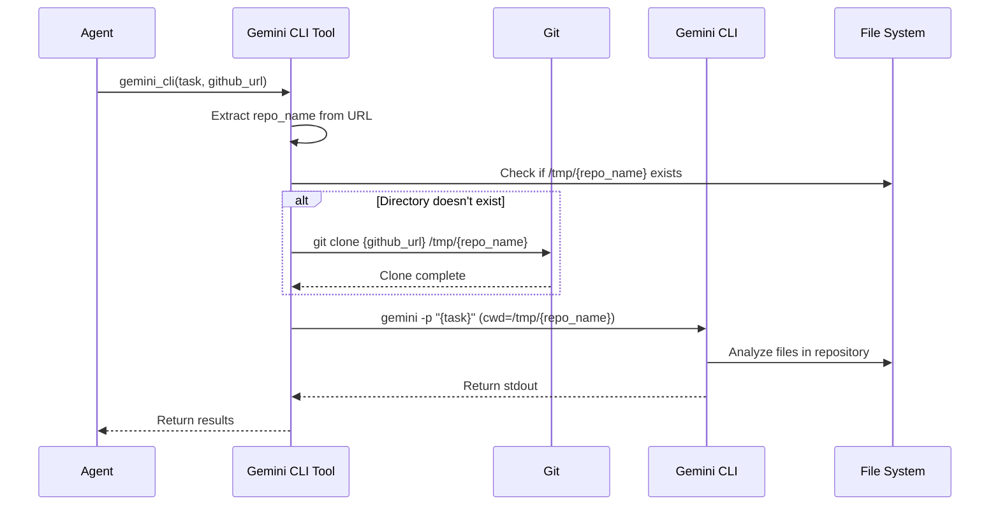

# Design Document

## Overview

This system implements an AI agent using Google's Agent Development Kit (ADK) that leverages the Gemini CLI as a powerful tool for software development lifecycle tasks. Instead of building complex code analysis and file manipulation logic from scratch, the agent delegates these capabilities to the Gemini CLI running in non-interactive mode. The agent is containerized and deployed on Cloud Run for serverless, scalable execution.

The key innovation is treating the Gemini CLI as a tool within the ADK framework, allowing the agent to orchestrate sophisticated code analysis without implementing low-level file operations.

## Architecture

### High-Level Architecture

```
┌─────────────────────────────────────────────────────────────────────────┐
│                          USER INTERACTION FLOW                          │
└─────────────────────────────────────────────────────────────────────────┘

    ┌──────────┐
    │   User   │
    └────┬─────┘
         │ HTTP Request
         │ (Task + GitHub URL)
         ▼
    ┌─────────────────────┐
    │  ADK Web Interface  │
    │   (localhost:8080)  │
    └──────────┬──────────┘
               │
               ▼
    ┌─────────────────────────────────────────────────────────────┐
    │                      ADK AGENT LAYER                        │
    │  ┌─────────────────────────────────────────────────────┐   │
    │  │  Root Agent (gemini-2.5-pro)                        │   │
    │  │  - Receives user request                            │   │
    │  │  - Determines tool to use                           │   │
    │  │  - Orchestrates execution                           │   │
    │  └──────────────────┬──────────────────────────────────┘   │
    └─────────────────────┼──────────────────────────────────────┘
                          │
                          ▼
    ┌─────────────────────────────────────────────────────────────┐
    │                    TOOL EXECUTION LAYER                     │
    │  ┌─────────────────────────────────────────────────────┐   │
    │  │  gemini_cli(task, github_url)                       │   │
    │  │  1. Extract repo name from URL                      │   │
    │  │  2. Check if repo exists in temp                    │   │
    │  │  3. Clone if needed (shallow, memory-optimized)     │   │
    │  │  4. Execute Gemini CLI with task                    │   │
    │  │  5. Return results                                  │   │
    │  └──────────────────┬──────────────────────────────────┘   │
    └─────────────────────┼──────────────────────────────────────┘
                          │
         ┌────────────────┼────────────────┐
         │                │                │
         ▼                ▼                ▼
    ┌─────────┐    ┌──────────┐    ┌─────────────┐
    │   Git   │    │  Gemini  │    │ File System │
    │  Clone  │    │   CLI    │    │   /tmp/     │
    └─────────┘    └──────────┘    └─────────────┘
         │                │                │
         └────────────────┴────────────────┘
                          │
                          ▼
                   ┌─────────────┐
                   │   Results   │
                   │  (stdout)   │
                   └──────┬──────┘
                          │
                          ▼
                   Back to User
```

### System Architecture Diagram

```
╔══════════════════════════════════════════════════════════════════════╗
║                        GEMINI CLI ADK AGENT                          ║
║                         SYSTEM ARCHITECTURE                          ║
╚══════════════════════════════════════════════════════════════════════╝

┌──────────────────────────────────────────────────────────────────────┐
│                      PRESENTATION LAYER                              │
│  ┌────────────────────────────────────────────────────────────┐     │
│  │  ADK Web Interface (Port 8080)                             │     │
│  │  • Chat-based UI                                           │     │
│  │  • Session management                                      │     │
│  │  • Real-time response display                              │     │
│  └────────────────────────────────────────────────────────────┘     │
└────────────────────────────┬─────────────────────────────────────────┘
                             │
                             ▼
┌──────────────────────────────────────────────────────────────────────┐
│                         AGENT LAYER                                  │
│  ┌────────────────────────────────────────────────────────────┐     │
│  │  ADK Agent (gemini-2.5-pro)                                │     │
│  │  • Natural language understanding                          │     │
│  │  • Tool selection & orchestration                          │     │
│  │  • Response generation                                     │     │
│  │                                                            │     │
│  │  Registered Tools:                                         │     │
│  │    └─ gemini_cli(task, github_url)                        │     │
│  └────────────────────────────────────────────────────────────┘     │
└────────────────────────────┬─────────────────────────────────────────┘
                             │
                             ▼
┌──────────────────────────────────────────────────────────────────────┐
│                          TOOL LAYER                                  │
│  ┌────────────────────────────────────────────────────────────┐     │
│  │  Gemini CLI Tool Wrapper                                   │     │
│  │                                                            │     │
│  │  Input:  task (str), github_url (str)                     │     │
│  │  Output: Analysis results (str)                           │     │
│  │                                                            │     │
│  │  Features:                                                 │     │
│  │    • Repository caching                                    │     │
│  │    • Memory-optimized git clone                           │     │
│  │    • Timeout management                                    │     │
│  │    • Error handling                                        │     │
│  └────────────────────────────────────────────────────────────┘     │
└────────────────────────────┬─────────────────────────────────────────┘
                             │
                             ▼
┌──────────────────────────────────────────────────────────────────────┐
│                       EXECUTION LAYER                                │
│                                                                      │
│  ┌──────────────┐    ┌──────────────┐    ┌──────────────┐         │
│  │  Git Clone   │    │  Gemini CLI  │    │ File System  │         │
│  │              │    │              │    │              │         │
│  │ • Shallow    │    │ • Code       │    │ • Temp dir   │         │
│  │   clone      │    │   analysis   │    │ • Caching    │         │
│  │ • Memory     │    │ • Test gen   │    │ • Cleanup    │         │
│  │   limits     │    │ • Refactor   │    │              │         │
│  └──────────────┘    └──────────────┘    └──────────────┘         │
│                                                                      │
│  External Dependencies:                                             │
│    • GitHub (public repos)                                          │
│    • Gemini API (via API key or Vertex AI)                         │
└──────────────────────────────────────────────────────────────────────┘
```

### Component Architecture

The system consists of four main layers:

1. **Presentation Layer**: ADK Web Interface for user interaction
2. **Agent Layer**: ADK Agent with reasoning and tool orchestration
3. **Tool Layer**: Gemini CLI Tool wrapper function
4. **Execution Layer**: Gemini CLI process and git operations

### Data Flow Diagram

```
┌─────────────────────────────────────────────────────────────────────┐
│                         REQUEST FLOW                                │
└─────────────────────────────────────────────────────────────────────┘

User Input:
"Generate unit tests for https://github.com/user/repo"
    │
    ▼
┌─────────────────────────────────────────────────────────────────────┐
│ 1. ADK Agent receives request                                       │
│    • Parses user intent                                             │
│    • Identifies need for gemini_cli tool                            │
└───────────────────────────┬─────────────────────────────────────────┘
                            │
                            ▼
┌─────────────────────────────────────────────────────────────────────┐
│ 2. Tool Execution: gemini_cli(                                      │
│       task="Generate unit tests",                                   │
│       github_url="https://github.com/user/repo"                     │
│    )                                                                │
└───────────────────────────┬─────────────────────────────────────────┘
                            │
                            ▼
┌─────────────────────────────────────────────────────────────────────┐
│ 3. Repository Handling                                              │
│    ┌─────────────────────────────────────────────────────────┐     │
│    │ Extract repo name: "repo"                               │     │
│    │ Check: /tmp/repo exists?                                │     │
│    │   ├─ YES → Use cached version                           │     │
│    │   └─ NO  → Clone repository                             │     │
│    │            git clone --depth 1 --single-branch          │     │
│    └─────────────────────────────────────────────────────────┘     │
└───────────────────────────┬─────────────────────────────────────────┘
                            │
                            ▼
┌─────────────────────────────────────────────────────────────────────┐
│ 4. Gemini CLI Execution                                             │
│    ┌─────────────────────────────────────────────────────────┐     │
│    │ Set environment:                                        │     │
│    │   • GEMINI_API_KEY=***                                  │     │
│    │   • NODE_OPTIONS=--max-old-space-size=4096              │     │
│    │                                                         │     │
│    │ Execute:                                                │     │
│    │   gemini "Generate unit tests"                          │     │
│    │   (working dir: /tmp/repo)                              │     │
│    │                                                         │     │
│    │ Timeout: 600 seconds                                    │     │
│    └─────────────────────────────────────────────────────────┘     │
└───────────────────────────┬─────────────────────────────────────────┘
                            │
                            ▼
┌─────────────────────────────────────────────────────────────────────┐
│ 5. Result Processing                                                │
│    ┌─────────────────────────────────────────────────────────┐     │
│    │ Capture stdout/stderr                                   │     │
│    │ Check return code                                       │     │
│    │   ├─ 0 → Return results                                 │     │
│    │   └─ Non-zero → Return error message                    │     │
│    └─────────────────────────────────────────────────────────┘     │
└───────────────────────────┬─────────────────────────────────────────┘
                            │
                            ▼
┌─────────────────────────────────────────────────────────────────────┐
│ 6. Agent Response                                                   │
│    • Formats results                                                │
│    • Presents to user via web interface                             │
└─────────────────────────────────────────────────────────────────────┘
                            │
                            ▼
                    User sees results
```

### Deployment Architecture

- **Container Runtime**: Docker container with Python 3.11, Node.js 20.x, git, and Gemini CLI
- **Hosting Platform**: Google Cloud Run (us-central1 region)
- **Build Pipeline**: Cloud Build with automated Docker image creation and deployment
- **Image Storage**: Artifact Registry (us-central1-docker.pkg.dev)

## Components and Interfaces

### 1. Project Structure

```
gemini-cli-on-adk/
├── app/
│   ├── __init__.py
│   ├── agent.py          # Main agent definition and gemini_cli tool
│   └── server.py         # FastAPI server (generated by starter pack)
├── pyproject.toml        # Python dependencies
├── uv.lock              # Locked dependencies
├── Dockerfile           # Container definition
├── cloudbuild.yaml      # Cloud Build configuration
└── README.md
```

### 2. ADK Agent Component

**File**: `app/agent.py`

**Responsibilities**:
- Define the root agent with model and instructions
- Register the gemini_cli tool
- Handle user requests and orchestrate tool calls

**Interface**:
```python
root_agent = Agent(
    name="root_agent",
    model="gemini-2.5-pro",
    instruction="""...""",
    tools=[gemini_cli],
)
```

**Key Design Decisions**:
- Use `gemini-2.5-pro` for advanced reasoning capabilities
- Explicit instructions to always use the Gemini CLI tool
- Single-tool design keeps the agent focused

### 3. Gemini CLI Tool Component

**File**: `app/agent.py`

**Function Signature**:
```python
def gemini_cli(task: str, github_url: str) -> str:
    """Executes the Gemini CLI.
    
    Args:
        task: The task to pass to Gemini CLI
        github_url: GitHub URL to clone and analyze
    
    Returns:
        The response from the Gemini CLI
    """
```

**Responsibilities**:
- Parse GitHub URL to extract repository name
- Clone repository to `/tmp/{repo_name}` if not already present
- Execute `gemini -p "{task}"` in the repository directory
- Capture and return stdout/stderr
- Handle timeouts and errors gracefully

**Key Design Decisions**:
- Repository caching: Only clone if directory doesn't exist (improves performance for repeated requests)
- Working directory: Execute gemini command with `cwd=codebaseDir` to ensure proper context
- Non-interactive mode: Use `-p` flag to pass task as command-line argument
- Timeout strategy: 5 minutes for git clone, 10 minutes for Gemini CLI execution
- Error handling: Return descriptive error messages for debugging

**Implementation Flow**:


### 4. Container Component

**File**: `Dockerfile`

**Base Image**: `python:3.11-slim`

**Installed Components**:
- Node.js 20.x (via NodeSource setup script)
- npm (bundled with Node.js)
- git (via apt-get)
- Gemini CLI (via npm global install: `@google/gemini-cli`)
- uv 0.6.12 (Python package manager)

**Build Process**:
1. Install system dependencies (curl, git, Node.js)
2. Install Gemini CLI globally
3. Install uv package manager
4. Copy project files (pyproject.toml, README.md, uv.lock, app/)
5. Run `uv sync --frozen` to install Python dependencies
6. Expose port 8080
7. Start ADK web interface: `adk web --host 0.0.0.0 --port 8080 .`

**Key Design Decisions**:
- Use `adk web` for development/demo purposes (provides web UI)
- For production, would use `uvicorn app.server:app` for API-only access
- Global Gemini CLI installation ensures it's available in PATH
- COMMIT_SHA build arg for version tracking

### 5. Build and Deployment Component

**File**: `cloudbuild.yaml`

**Build Steps**:
1. **Build Docker Image**: 
   - Pass COMMIT_SHA as build argument
   - Tag as `us-central1-docker.pkg.dev/$PROJECT_ID/container/gemini-cli-adk:latest`
2. **Push to Artifact Registry**:
   - Push tagged image to Artifact Registry
3. **Deploy to Cloud Run**:
   - Service name: `gemini-cli-adk`
   - Region: `us-central1`
   - Image: Latest from Artifact Registry

**Key Design Decisions**:
- Single cloudbuild.yaml for complete CI/CD pipeline
- Use latest tag for simplicity (production would use versioned tags)
- Automatic deployment on successful build

### 6. Web Interface Component

**Provided by**: ADK framework (`adk web` command)

**Responsibilities**:
- Render chat interface for user interaction
- Accept user input (task description and GitHub URL)
- Display agent responses and tool execution results
- Handle session management

**Key Design Decisions**:
- Use built-in ADK web interface for rapid development
- No custom UI development required
- Suitable for demos and internal tools

## Data Models

### Tool Input Model

```python
{
    "task": str,        # Natural language instruction for Gemini CLI
    "github_url": str   # Public GitHub repository URL
}
```

**Example**:
```python
{
    "task": "Generate unit tests for the main module",
    "github_url": "https://github.com/username/repo.git"
}
```

### Tool Output Model

```python
str  # Plain text response from Gemini CLI stdout or error message
```

**Success Example**:
```
Here are the generated unit tests for the main module:

[Generated test code...]
```

**Error Example**:
```
Error cloning repository: fatal: repository 'https://github.com/invalid/repo.git' not found
```

### Agent Request Model

Handled internally by ADK framework. User provides natural language input through web interface.

### Repository Cache Model

```python
{
    "path": "/tmp/{repo_name}",  # Local directory path
    "exists": bool                # Whether directory exists
}
```

## Error Handling

### Error Handling Flow Diagram

```
┌─────────────────────────────────────────────────────────────────────┐
│                      ERROR HANDLING FLOW                            │
└─────────────────────────────────────────────────────────────────────┘

                    User Request
                         │
                         ▼
              ┌──────────────────────┐
              │  gemini_cli() called │
              └──────────┬───────────┘
                         │
                         ▼
              ┌──────────────────────┐
              │  Extract repo name   │
              └──────────┬───────────┘
                         │
                         ▼
              ┌──────────────────────┐
              │  Check if repo       │
              │  exists in /tmp      │
              └──────────┬───────────┘
                         │
                    ┌────┴────┐
                    │         │
                  YES        NO
                    │         │
                    │         ▼
                    │    ┌─────────────────────────┐
                    │    │  Git Clone              │
                    │    │  --depth 1              │
                    │    │  --single-branch        │
                    │    │  Timeout: 300s          │
                    │    └──────────┬──────────────┘
                    │               │
                    │          ┌────┴────┐
                    │          │         │
                    │       SUCCESS    FAIL
                    │          │         │
                    │          │         ▼
                    │          │    ┌──────────────────────┐
                    │          │    │ • Cleanup partial    │
                    │          │    │   clone              │
                    │          │    │ • Return error msg   │
                    │          │    │   with stderr        │
                    │          │    └──────────────────────┘
                    │          │              │
                    └──────────┴──────────────┘
                               │
                               ▼
                    ┌──────────────────────┐
                    │  Execute Gemini CLI  │
                    │  Timeout: 600s       │
                    │  Memory: 4GB         │
                    └──────────┬───────────┘
                               │
                          ┌────┴────┐
                          │         │
                       SUCCESS    FAIL
                          │         │
                          ▼         ▼
                    ┌─────────┐  ┌──────────────────────┐
                    │ Return  │  │ • Check return code  │
                    │ stdout  │  │ • Return stderr      │
                    │         │  │ • Include exit code  │
                    └─────────┘  └──────────────────────┘
                          │              │
                          └──────┬───────┘
                                 │
                                 ▼
                          Back to Agent
                                 │
                                 ▼
                          Presented to User
```

### 1. Git Clone Errors

**Scenarios**:
- Repository not found (404)
- Network timeout
- Authentication required (private repo)
- Disk space issues

**Handling**:
- Catch subprocess errors
- Return descriptive error message with stderr
- 5-minute timeout prevents indefinite hanging
- User receives clear feedback about what went wrong

### 2. Gemini CLI Execution Errors

**Scenarios**:
- Invalid task prompt
- Gemini CLI not installed
- API quota exceeded
- Command timeout

**Handling**:
- Check return code from subprocess
- Return stderr on non-zero exit
- 10-minute timeout for long-running analysis
- Preserve full error context for debugging

### 3. Subprocess Timeout Errors

**Scenarios**:
- Large repository clone takes too long
- Complex analysis exceeds time limit

**Handling**:
- Catch `subprocess.TimeoutExpired` exception
- Return user-friendly timeout message
- Configurable timeout values (300s for clone, 600s for CLI)

### 4. File System Errors

**Scenarios**:
- /tmp directory not writable
- Disk full
- Permission denied

**Handling**:
- Catch general Exception
- Return error message with exception details
- Fail gracefully without crashing agent

### 5. Cloud Run Errors

**Scenarios**:
- Request timeout (>60 minutes)
- Out of memory
- Cold start delays

**Handling**:
- Cloud Run automatically handles container lifecycle
- Request timeout configured at deployment level
- Memory limits set in Cloud Run configuration
- Cold starts mitigated by keeping instances warm (optional)

## Testing Strategy

### 1. Unit Tests

**Target**: `gemini_cli` function

**Test Cases**:
- Test successful repository clone and Gemini CLI execution
- Test repository caching (second call doesn't re-clone)
- Test git clone timeout handling
- Test Gemini CLI timeout handling
- Test invalid GitHub URL handling
- Test subprocess error handling
- Test return value parsing

**Mocking Strategy**:
- Mock `subprocess.run` for git and gemini commands
- Mock `os.path.exists` for directory checks
- Mock `os.environ` for environment variables

### 2. Integration Tests

**Target**: Full agent workflow

**Test Cases**:
- Test agent receives user request and calls gemini_cli tool
- Test agent handles tool response correctly
- Test agent presents results to user
- Test end-to-end flow with real GitHub repository (small test repo)

**Environment**:
- Use test GitHub repository with known structure
- Run against local ADK agent instance
- Verify tool is called with correct parameters

### 3. Container Tests

**Target**: Docker image

**Test Cases**:
- Verify all dependencies installed (Node.js, git, Gemini CLI, uv)
- Verify Gemini CLI is in PATH and executable
- Verify ADK web server starts successfully
- Verify port 8080 is exposed and accessible

**Approach**:
- Build Docker image locally
- Run container and execute health checks
- Test gemini command availability inside container

### 4. Deployment Tests

**Target**: Cloud Run service

**Test Cases**:
- Verify service deploys successfully
- Verify service is accessible via HTTPS
- Verify authentication works (IAM-based)
- Verify service scales to zero after idle period
- Verify service scales up under load

**Approach**:
- Deploy to test Cloud Run service
- Send test requests via HTTP client
- Monitor Cloud Run metrics and logs
- Verify auto-scaling behavior

### 5. End-to-End Tests

**Target**: Complete user workflow

**Test Scenario**:
1. User accesses ADK web interface
2. User submits task: "Explain this codebase"
3. User provides GitHub URL: "https://github.com/test/sample-repo"
4. Agent clones repository
5. Agent executes Gemini CLI
6. Agent returns analysis results
7. User sees results in web interface

**Validation**:
- Verify results are accurate and relevant
- Verify response time is acceptable (<2 minutes for small repos)
- Verify error messages are clear if something fails

### 6. Performance Tests

**Metrics to Measure**:
- Repository clone time (varies by repo size)
- Gemini CLI execution time (varies by task complexity)
- End-to-end request latency
- Cold start time for Cloud Run
- Memory usage during execution

**Targets**:
- Small repos (<10MB): <30 seconds total
- Medium repos (10-100MB): <2 minutes total
- Large repos (>100MB): <5 minutes total
- Cold start: <10 seconds

### 7. Security Tests

**Test Cases**:
- Verify only public repositories can be cloned (no credential leakage)
- Verify /tmp directory isolation between requests
- Verify no sensitive data in logs
- Verify IAM authentication prevents unauthorized access
- Verify service account has minimal required permissions

**Approach**:
- Attempt to clone private repository (should fail)
- Review Cloud Run logs for sensitive data
- Test unauthenticated access (should be denied)
- Review service account permissions

## Security Considerations

### 1. Repository Access

- **Current Design**: Only supports public GitHub repositories
- **Rationale**: Avoids credential management complexity
- **Future Enhancement**: Support private repos via GitHub tokens stored in Secret Manager

### 2. Code Execution Isolation

- **Approach**: Each repository cloned to unique /tmp directory
- **Limitation**: Multiple concurrent requests could access same /tmp directory
- **Mitigation**: Use unique subdirectories per request (e.g., /tmp/{repo_name}-{request_id})

### 3. Service Authentication

- **Approach**: Cloud Run IAM-based authentication
- **Configuration**: Require authentication for all requests
- **Service Account**: Assign minimal permissions (Vertex AI User for Gemini API)

### 4. Input Validation

- **GitHub URL**: Validate URL format before cloning
- **Task Prompt**: Sanitize input to prevent command injection
- **Implementation**: Use parameterized subprocess calls, avoid shell=True where possible

### 5. Resource Limits

- **Timeout**: Enforce strict timeouts to prevent resource exhaustion
- **Memory**: Configure Cloud Run memory limits
- **Disk**: /tmp directory has limited space, clean up after requests

## Scalability Considerations

### 1. Cloud Run Auto-Scaling

- **Scale to Zero**: No cost when idle
- **Scale Up**: Automatically handle traffic spikes
- **Concurrency**: Configure max concurrent requests per instance
- **Recommendation**: Start with concurrency=1 for resource-intensive tasks

### 2. Repository Caching

- **Current Design**: Cache cloned repos in /tmp
- **Limitation**: /tmp is ephemeral, cleared on instance restart
- **Enhancement**: Use persistent volume or Cloud Storage for caching

### 3. Gemini CLI Performance

- **Bottleneck**: Gemini CLI execution time varies by task
- **Mitigation**: Set appropriate timeouts, provide user feedback
- **Enhancement**: Implement async processing for long-running tasks

### 4. Cold Start Optimization

- **Issue**: First request after scale-to-zero has higher latency
- **Mitigation**: Use Cloud Run minimum instances (costs more)
- **Alternative**: Accept cold start latency for cost savings

## Deployment Configuration

### Cloud Run Settings

```yaml
Service Name: gemini-cli-adk
Region: us-central1
CPU: 1
Memory: 2Gi
Timeout: 3600s (60 minutes)
Max Instances: 10
Min Instances: 0
Concurrency: 1
Authentication: Require authentication (IAM)
```

### Service Account Permissions

```
roles/aiplatform.user  # For Gemini API access
```

### Environment Variables

```
GOOGLE_CLOUD_PROJECT: {project_id}
```

## Monitoring and Observability

### Cloud Run Metrics

- Request count
- Request latency (p50, p95, p99)
- Error rate
- Instance count
- CPU utilization
- Memory utilization

### Application Logs

- Git clone operations (success/failure)
- Gemini CLI execution (command, duration, result)
- Error messages with full context
- Request/response logging

### Alerts

- Error rate > 10%
- Request latency > 5 minutes
- Instance count > 8 (approaching limit)
- Memory usage > 90%

## Future Enhancements

1. **Private Repository Support**: Integrate with Secret Manager for GitHub tokens
2. **Persistent Caching**: Use Cloud Storage for repository caching across instances
3. **Async Processing**: Implement job queue for long-running tasks
4. **Multi-SCM Support**: Add support for GitLab, Bitbucket, etc.
5. **Result Streaming**: Stream Gemini CLI output in real-time
6. **API-Only Mode**: Deploy production version with uvicorn for API access
7. **Rate Limiting**: Implement per-user rate limits
8. **Cost Tracking**: Monitor Gemini API usage and costs per request
