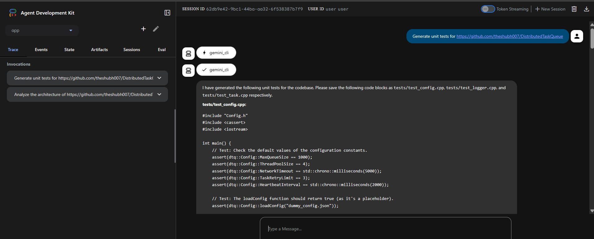
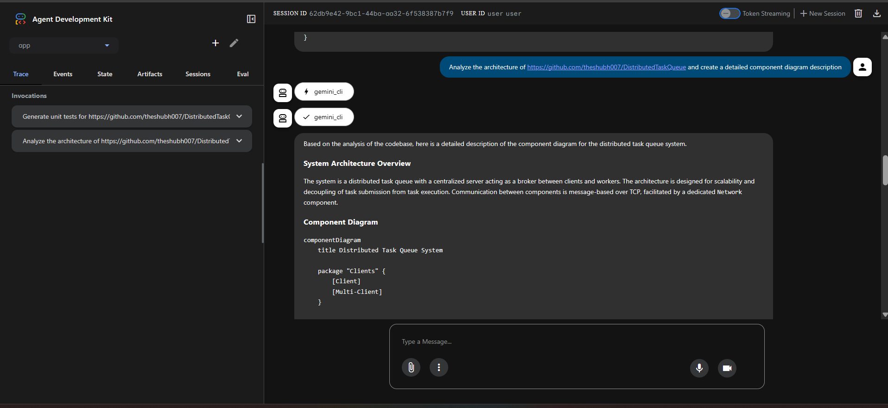

# 🛠️ Agent 2: RepoLens - AI-Powered Repository Analysis Agent

## 🎯 Project Goal

RepoLens is an intelligent AI agent that automates comprehensive code analysis for any public GitHub repository. Simply provide a repository URL, and RepoLens automatically clones it, analyzes the entire codebase, generates unit tests, performs security audits, provides code quality insights, and delivers refactoring recommendations. This agent demonstrates advanced tool integration by using Gemini CLI as a powerful tool within an ADK pipeline for automated software development lifecycle tasks.

## 📹 Video Demonstration
[Walkthrough YouTube Video](https://youtu.be/c0Ec0y3wieE)

## 🏗️ Architecture Overview

### Agent Capabilities
- **Repository Cloning**: Automatically clones any public GitHub repository
- **Code Analysis**: Deep analysis of entire codebases with architecture insights
- **Test Generation**: Automatically generates comprehensive unit tests
- **Security Audits**: Identifies vulnerabilities and security issues
- **Code Quality Review**: Provides refactoring recommendations and best practices
- **Documentation Generation**: Creates API documentation and README files
- **Performance Analysis**: Identifies bottlenecks and optimization opportunities

### Key Components
1. **ADK Agent** - Main orchestrator with reasoning capabilities
2. **Gemini CLI Tool** - AI-powered code analysis wrapper
3. **Git Integration** - Automated repository cloning with memory optimization
4. **Cloud Run Service** - Serverless deployment platform

---

## 📋 Implementation Steps

### Step 1: Environment Setup
- Install Python 3.10-3.14
- Install Node.js 20.x or higher
- Install Gemini CLI via npm
- Configure Gemini API key
- Set up virtual environment

### Step 2: Tool Wrapper Development
- Create `gemini_cli` tool function
- Implement GitHub repository cloning logic
- Handle input/output formatting
- Implement error handling and timeouts
- Add memory optimization for large repos

### Step 3: Agent Development
- Create ADK agent with Gemini 2.5 Pro model
- Integrate Gemini CLI tool
- Define agent instructions for code analysis
- Configure tool orchestration

### Step 4: Repository Processing
- Implement shallow cloning (--depth 1)
- Configure git memory limits
- Add repository caching mechanism
- Handle cleanup for failed operations

### Step 5: Cloud Run Deployment
- Create Dockerfile with dependencies
- Configure Cloud Run service
- Set environment variables (API keys, project ID)
- Deploy and test service

### Step 6: Testing & Validation
- Test with various repository sizes
- Validate test generation capabilities
- Test security audit functionality
- Performance testing with large codebases

---

## 🚀 Usage Examples

### Example 1: Generate Unit Tests
**Input:** "Generate comprehensive unit tests for https://github.com/username/my-project"

**Agent Actions:**
1. Clones the repository to temp directory
2. Analyzes codebase structure
3. Calls Gemini CLI for test generation
4. Generates unit tests for all modules
5. Returns complete test suite

**Output:** Comprehensive unit tests with coverage recommendations

### Example 2: Security Audit
**Input:** "Perform a security audit on https://github.com/username/web-app and identify vulnerabilities"

**Agent Actions:**
1. Clones repository with shallow clone
2. Scans codebase for security issues
3. Uses Gemini CLI for vulnerability analysis
4. Identifies potential security risks
5. Provides remediation recommendations

**Output:** Detailed security report with vulnerability classifications and fixes

### Example 3: Code Quality Analysis
**Input:** "Analyze https://github.com/username/api-service and suggest refactoring opportunities"

**Agent Actions:**
1. Clones and caches repository
2. Analyzes code quality metrics
3. Identifies code smells and anti-patterns
4. Generates refactoring recommendations
5. Suggests design pattern improvements

**Output:** Code quality report with actionable refactoring suggestions

### Example 4: Architecture Analysis
**Input:** "Explain the architecture of https://github.com/username/microservices-app"

**Agent Actions:**
1. Clones repository
2. Maps component relationships
3. Analyzes system design patterns
4. Identifies architectural layers
5. Generates architecture documentation

**Output:** Comprehensive architecture overview with component diagrams

---

## 🔑 Key Features

### Automated Repository Analysis
- One-click analysis of any public GitHub repository
- Automatic cloning with memory optimization
- Repository caching for repeated analysis
- Support for large codebases (4GB Node.js heap)

### Comprehensive Code Intelligence
- **Test Generation**: Automatically creates unit tests for entire repositories
- **Security Audits**: Identifies vulnerabilities and security issues
- **Code Quality**: Provides refactoring recommendations and best practices
- **Architecture Insights**: Explains system design and component relationships
- **Performance Analysis**: Identifies bottlenecks and optimization opportunities
- **Documentation**: Generates API docs and README files

### Advanced Tool Integration
- Seamless Gemini CLI integration as ADK tool
- Non-interactive CLI execution
- Robust error handling and timeouts
- Input/output formatting and validation

### Production-Ready Deployment
- Serverless Cloud Run architecture
- Auto-scaling for variable workloads
- Memory-optimized git operations
- Automatic cleanup of failed operations

---

## 💡 Best Practices

### Repository Handling
- Use shallow cloning (--depth 1) to minimize memory usage
- Configure git memory limits (10-20MB) for large repos
- Implement repository caching to avoid redundant clones
- Clean up failed clones automatically

### Tool Integration
- Wrap CLI tools with proper error handling
- Set appropriate timeouts (5 min for clone, 10 min for analysis)
- Use full path resolution for Windows compatibility
- Increase Node.js heap size for large codebases

### Agent Design
- Provide clear instructions to the agent about tool capabilities
- Handle both API key and Vertex AI authentication
- Log operations for debugging and monitoring
- Return structured, actionable results to users

---

## 🔗 Resources

- Article: https://medium.com/@derrickchwong/combine-adk-gemini-cli-and-cloud-run-c5dea5118853
- Code: https://github.com/derrickchwong/gemini-cli-on-adk
- Gemini CLI: https://github.com/google/generative-ai-cli

---

## 📸 Project Output

---

## ✅ Completion Checklist

- [ ] Python 3.10+ and Node.js 20+ installed
- [ ] Gemini CLI installed globally via npm
- [ ] Gemini API key configured in .env file
- [ ] Virtual environment created and dependencies installed
- [ ] `gemini_cli` tool wrapper implemented with git integration
- [ ] ADK agent created with Gemini 2.5 Pro model
- [ ] Repository cloning with memory optimization working
- [ ] Test generation functionality validated
- [ ] Security audit capabilities tested
- [ ] Code quality analysis working
- [ ] Cloud Run deployment successful (optional)
- [ ] Monitoring and logging configured
- [ ] Video walkthrough recorded

## 🎯 Use Cases

RepoLens is perfect for:
- **Code Reviews**: Get instant, comprehensive code quality analysis
- **Onboarding**: Quickly understand new codebases and their architecture
- **Security Audits**: Identify vulnerabilities before deployment
- **Test Coverage**: Generate missing unit tests automatically
- **Technical Debt**: Identify refactoring opportunities and code smells
- **Documentation**: Generate API docs and architecture overviews
- **Due Diligence**: Analyze third-party repositories before integration

---

**Agent:** 2 of 5
**Complexity:** Medium
**Points:** 100
**Project Name:** RepoLens
