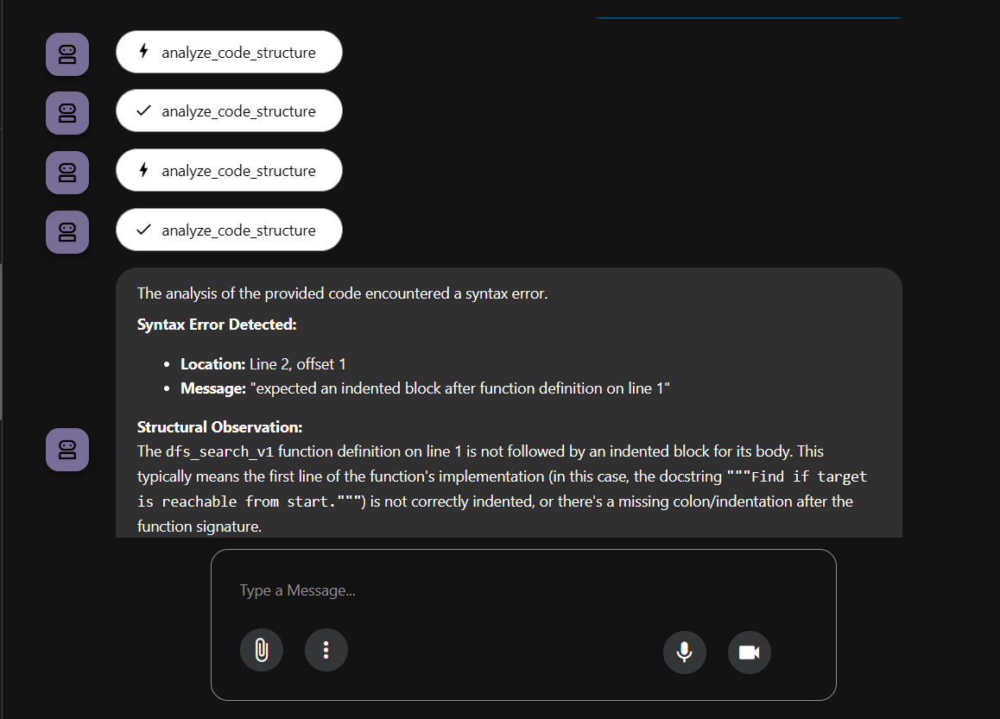
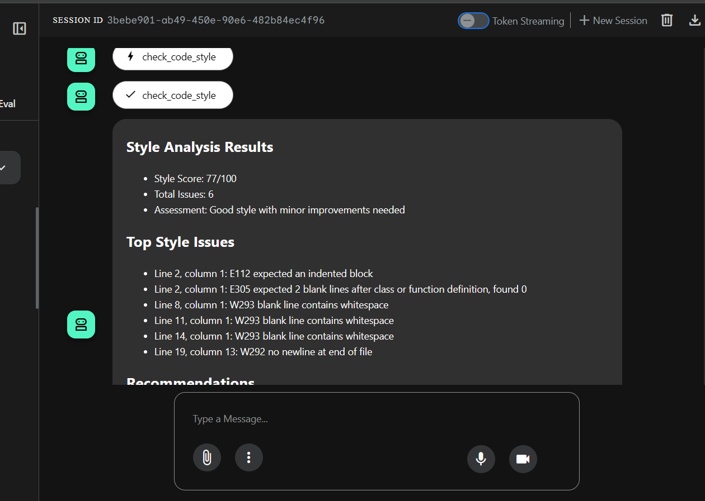
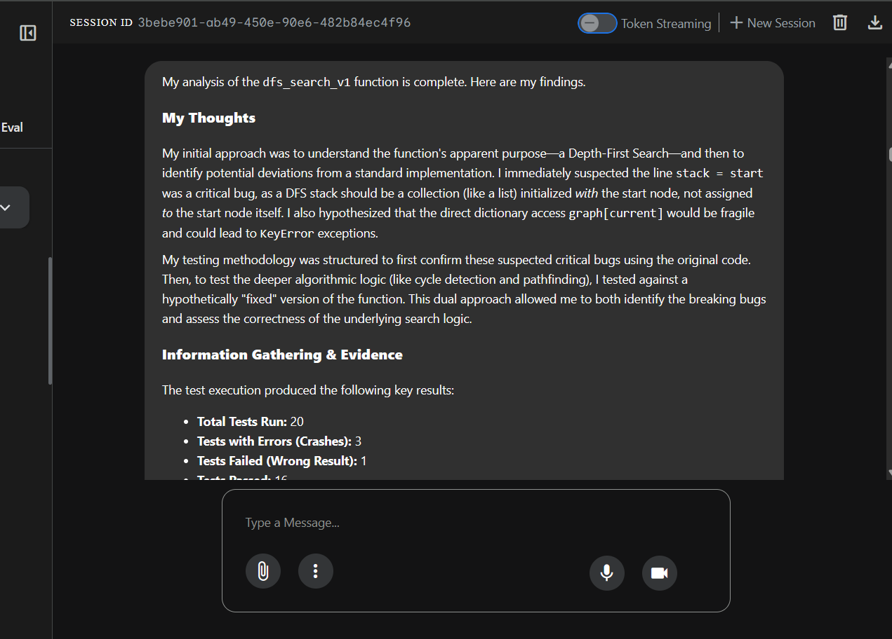
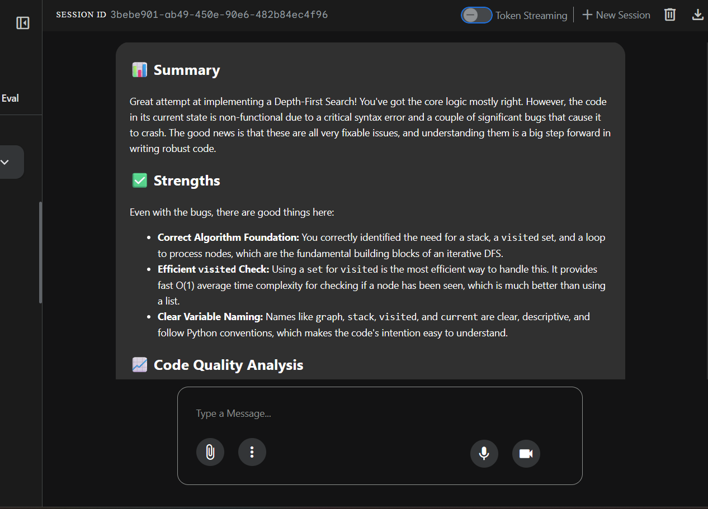
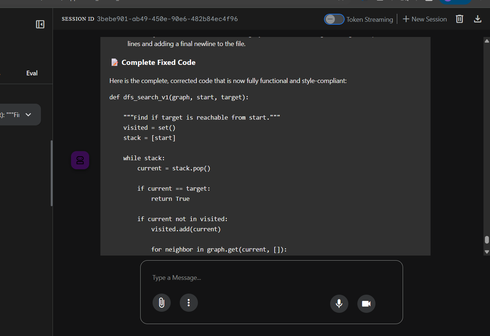

# 🤖 AI-Powered Code Review Assistant

**An intelligent multi-agent system for automated code review and fixing**

I built this production-ready code review assistant using Google's Agent Development Kit (ADK) and Gemini AI. The system analyzes Python code, identifies issues, and can automatically fix problems through an iterative refinement process with up to 3 validation attempts.


## 📹 Video Demonstration
[Walkthrough YouTube Video](https://youtu.be/EuK-QJoGaCw)

## 📊 System Architecture

```
┌─────────────────────────────────────────────────────────────────┐
│                      ROOT AGENT                                  │
│              (Sequential Orchestrator)                           │
└────────────────────────┬────────────────────────────────────────┘
                         │
         ┌───────────────┼───────────────┐
         │               │               │
         ▼               ▼               ▼
┌────────────────┐ ┌──────────┐ ┌────────────────┐
│ REVIEW PIPELINE│→│   FIX    │→│  FIX PIPELINE  │
│  (Sequential)  │ │  PROMPT  │ │  (Loop-based)  │
└────────────────┘ └──────────┘ └────────────────┘
         │              │               │
    ┌────┴────┐         │          ┌────┴────┐
    │         │         │          │         │
    ▼         ▼         ▼          ▼         ▼
┌────────┐ ┌────────┐ Asks   ┌────────┐ ┌────────┐
│ Code   │ │ Style  │ User   │ Code   │ │  Fix   │
│Analyzer│→│Checker │ "Fix?" │ Fixer  │→│ Test   │
└────────┘ └────────┘         └────────┘ │ Runner │
    │         │                     ▲     └────────┘
    ▼         ▼                     │         │
┌────────┐ ┌────────┐              │         ▼
│  Test  │ │Feedback│         ┌────────┐ ┌────────┐
│ Runner │→│Synth.  │         │  Fix   │ │  Fix   │
└────────┘ └────────┘         │Valid.  │→│ Synth. │
                               └────────┘ └────────┘
                                    │
                                    └──(Loop max 3x)
                                    Uses escalate flag
                                    to exit on success

9 SPECIALIZED AGENTS:
• 1 Root Orchestrator
• 1 Fix Prompt Agent
• 4 Review Pipeline Agents
• 3 Fix Loop Agents (iterative)
• 1 Fix Synthesizer (final report)
```

## 🎯 What I Built

This project implements a sophisticated AI agent system with:

- **Dual Pipeline Architecture**: Separate review and fix workflows orchestrated by a root agent
- **9 Specialized Agents**: 1 orchestrator, 1 fix prompt, 4 review agents, 3 fix loop agents, 1 synthesizer
- **Iterative Fix Loop**: Automatically attempts to fix issues up to 3 times with validation and conditional exit
- **Custom Tools**: 8+ specialized tools including AST parsing, PEP 8 validation, style comparison, and report compilation
- **Three-Tier State Management**: Temporary (invocation), session (conversation), and user (persistent) state layers
- **Dual-Model Strategy**: Gemini 2.5 Flash for fast analysis, Gemini 2.5 Pro for nuanced feedback
- **Production Deployment**: Three deployment modes - Local (in-memory), Cloud Run (Cloud SQL), Agent Engine (VertexAI)
- **Observability**: Cloud Trace integration for monitoring agent execution and performance

## 🔄 Complete Workflow (Step-by-Step)

Here's exactly what happens when you submit code for review:

**Agent Execution Flow:**
```
User Input → Root Agent (Sequential) → Review Pipeline → Fix Prompt → Fix Pipeline → Response
```

```
USER SUBMITS CODE
       │
       ▼
┌──────────────────────────────────────────────────────────────┐
│ PHASE 1: REVIEW PIPELINE (Sequential Execution)             │
└──────────────────────────────────────────────────────────────┘
       │
       ├─► Step 1: CODE ANALYZER
       │   • Parses code using Python AST
       │   • Extracts functions, classes, parameters
       │   • Calculates cyclomatic complexity
       │   • Detects syntax errors
       │   • Output: "Syntax Error Detected" OR "Code Structure Analysis"
       │
       ├─► Step 2: STYLE CHECKER (runs in parallel with analyzer)
       │   • Validates against PEP 8 standards
       │   • Checks naming conventions
       │   • Identifies indentation issues
       │   • Output: "Style Score: X/100" + list of violations
       │
       ├─► Step 3: TEST RUNNER
       │   • Executes code in sandboxed environment
       │   • Catches runtime errors (AttributeError, KeyError, etc.)
       │   • Validates logic with test cases
       │   • Output: "Outcome: OK" OR error details
       │
       └─► Step 4: FEEDBACK SYNTHESIZER
           • Aggregates all findings from above agents
           • Searches past feedback for similar issues
           • Generates comprehensive report with:
             - Summary of strengths
             - Critical issues found
             - Specific recommendations
             - Priority-ordered fixes
           • Output: "📊 Summary" with detailed feedback
           • Asks: "💡 I can try to fix these issues for you. Would you like me to do that?"

       ▼
USER ACCEPTS FIX OFFER
       │
       ▼
┌──────────────────────────────────────────────────────────────┐
│ PHASE 2: FIX PIPELINE (Iterative Loop, Max 3 Attempts)      │
└──────────────────────────────────────────────────────────────┘
       │
       ├─► Iteration 1:
       │   ├─► CODE FIXER
       │   │   • Applies corrections based on review feedback
       │   │   • Fixes syntax, style, and logic issues
       │   │   • Output: Fixed code
       │   │
       │   ├─► FIX TEST RUNNER
       │   │   • Re-runs tests on fixed code
       │   │   • Output: Pass rate (e.g., "19/20 tests passed")
       │   │
       │   └─► FIX VALIDATOR
       │       • Checks if all issues resolved
       │       • If YES → Exit loop, go to Fix Synthesizer
       │       • If NO → Loop back to Code Fixer (max 3 times)
       │
       └─► FIX SYNTHESIZER (after loop exits)
           • Compares original vs fixed code
           • Generates final report:
             - "✅ SUCCESSFUL" or "⚠️ PARTIAL"
             - What was fixed
             - Test pass rate improvement
             - Style score improvement
             - Remaining issues (if any)
           • Output: Complete fix summary + final corrected code

       ▼
PROCESS COMPLETE
```

## 🏗️ How It Works (Technical Details)

**Review Pipeline (Sequential Flow)**
1. **Code Analyzer**: Parses Python code using AST to extract functions, classes, complexity metrics, and docstrings
2. **Style Checker**: Validates code against PEP 8 standards using pycodestyle with weighted scoring (100-point scale)
3. **Test Runner**: Generates 15-20 test cases and executes them using BuiltInCodeExecutor to identify bugs
4. **Feedback Synthesizer**: Searches past feedback, updates grading progress, aggregates findings, and saves reports

**Fix Prompt Agent (User Interaction)**
- Analyzes review results to determine if fixes are needed
- Asks user: "💡 I can try to fix these issues for you. Would you like me to do that?"
- Only triggers if style_score < 100 OR tests failed OR syntax errors exist

**Fix Pipeline (Iterative Loop - Max 3 Attempts)**
1. **Code Fixer**: Applies corrections based on review feedback (outputs clean Python code)
2. **Fix Test Runner**: Re-runs the same test suite on fixed code to measure improvement
3. **Fix Validator**: 
   - Calls `validate_fixed_style()` to check style compliance
   - Calls `compile_fix_report()` to generate comprehensive comparison
   - If SUCCESSFUL (all tests pass + style 100), calls `exit_fix_loop()` to set escalate flag
   - Otherwise, loop continues for another attempt
4. **Fix Synthesizer**: Produces final report with metrics, before/after code, and explanations

**State Management System**
- **Temporary State**: Cleared after each invocation (e.g., `temp:test_code_to_execute`)
- **Session State**: Persists within conversation (e.g., `code_to_review`, `style_score`)
- **User State**: Persists across sessions (e.g., `user:total_submissions`, `user:past_feedback_cache`)
- **Centralized Keys**: All state keys defined in `constants.py` for type safety

## � Examkple Conversation Flow

**What you see in action:**

```
YOU: "Please analyze the following: def dfs_search_v1(graph, start, target): ..."

SYSTEM (Code Analyzer): 
"Syntax Error Detected: Line 2, offset 1 - expected an indented block"

SYSTEM (Style Checker):
"Style Score: 77/100
Total Issues: 6
- Line 2: E112 expected an indented block
- Line 8: W293 blank line contains whitespace"

SYSTEM (Test Runner):
"Test Results: 16 passed, 1 failed, 3 errors
Critical Issues Found: 2
- AttributeError: stack initialization bug
- KeyError: unsafe node access"

SYSTEM (Feedback Synthesizer):
"📊 Summary: Your DFS implementation has the right logic but critical bugs...
✅ Strengths: Correct algorithm foundation, efficient visited check
💡 Recommendations: Fix indentation, change stack = start to stack = [start]
💡 I can try to fix these issues for you. Would you like me to do that?"

YOU: "Yes, please fix it"

SYSTEM (Fix Pipeline - Iteration 1):
"Applying fixes... Testing... Pass rate: 95% (19/20 tests)
One test still failing, attempting refinement..."

SYSTEM (Fix Synthesizer):
"✅ SUCCESSFUL
Test Results: 80% → 100%
Style Score: 77/100 → 100/100
All critical issues resolved. Here's your corrected code..."
```

## 🚀 Quick Start

### Prerequisites

- Python 3.10 or higher
- Google Cloud account with billing enabled
- `gcloud` CLI installed and authenticated

### Installation

**1. Clone the repository:**
```bash
git clone https://github.com/ayoisio/code-review-assistant.git
cd code-review-assistant
```

**2. Set up Python environment:**
```bash
python -m venv .venv
source .venv/bin/activate  # Windows: .venv\Scripts\activate
```

**3. Install dependencies:**
```bash
pip install -r code_review_assistant/requirements.txt
```

**4. Configure environment variables:**
```bash
cp .env.example .env
# Edit .env and add your GOOGLE_CLOUD_PROJECT and other settings
```

**5. Run the assistant:**
```bash
# For local development with web UI
adk web code_review_assistant --port 8080

# Or use the deployment script
./deploy.sh local
```

## ⚙️ Configuration

The assistant uses environment variables for configuration. Copy `.env.example` to `.env` and customize:

**Required for Cloud Deployments:**
```bash
GOOGLE_CLOUD_PROJECT=your-project-id
GOOGLE_CLOUD_LOCATION=us-central1
```

**Model Configuration:**
```bash
GOOGLE_GENAI_USE_VERTEXAI=true          # Use Vertex AI (true) or AI Studio (false)
WORKER_MODEL=gemini-2.5-flash           # Fast analysis model
CRITIC_MODEL=gemini-2.5-pro             # Advanced feedback model
```

**Grading Parameters:**
```bash
PASSING_SCORE_THRESHOLD=0.8             # Minimum score to pass (0.0-1.0)
STYLE_WEIGHT=0.3                        # Weight for style in final grade
TEST_WEIGHT=0.5                         # Weight for tests in final grade
STRUCTURE_WEIGHT=0.2                    # Weight for structure in final grade
MAX_GRADING_ATTEMPTS=3                  # Maximum grading attempts per session
```

**Cloud Run Database (for `./deploy.sh cloud-run`):**
```bash
CLOUD_SQL_INSTANCE_NAME=your-instance
DB_USER=your-db-user
DB_PASSWORD=your-db-password
DB_NAME=sessions
```

**Agent Engine (for `./deploy.sh agent-engine`):**
```bash
AGENT_ENGINE_ID=your-agent-engine-id    # For updates to existing deployment
STAGING_BUCKET=gs://your-staging-bucket
```

**Artifact Storage:**
```bash
ARTIFACT_BUCKET=gs://your-artifacts    # GCS bucket for reports and artifacts
```

**Logging:**
```bash
LOG_LEVEL=INFO                         # DEBUG, INFO, WARNING, ERROR, CRITICAL
DEBUG_MODE=false                       # Enable verbose debug output
```

## 📂 Project Structure

```
code-review-assistant/
├── code_review_assistant/
│   ├── agent.py                 # Root agent and pipeline orchestration (9 agents)
│   ├── agent_engine_app.py      # Agent Engine wrapper with AdkApp
│   ├── config.py                # Configuration with Pydantic validation
│   ├── constants.py             # StateKeys class with 30+ constants
│   ├── tools.py                 # 9 custom tools (AST, style, reports, etc.)
│   ├── services.py              # Service initialization (artifact, session)
│   ├── requirements.txt         # Python dependencies
│   └── sub_agents/
│       ├── review_pipeline/     # Review workflow (4 agents)
│       │   ├── code_analyzer.py          # AST parsing & structure
│       │   ├── style_checker.py          # PEP 8 validation
│       │   ├── test_runner.py            # Test generation & execution
│       │   └── feedback_synthesizer.py   # Comprehensive feedback
│       └── fix_pipeline/        # Fix workflow (4 agents)
│           ├── code_fixer.py             # Applies corrections
│           ├── fix_test_runner.py        # Validates fixes
│           ├── fix_validator.py          # Success check & loop exit
│           └── fix_synthesizer.py        # Final report
├── tests/                       # Test suite
│   ├── integration/             # Integration tests
│   ├── test_code_analyzer.py    # Unit tests for analyzer
│   ├── test_code_review_agent.py # Integration tests
│   └── test_agent_engine.py     # E2E tests for deployed agents
├── .env.example                 # Environment variable template
├── deploy.sh                    # Unified deployment script (local/cloud-run/agent-engine)
├── Dockerfile                   # Multi-stage container build
├── main.py                      # FastAPI entry point for Cloud Run
└── pyproject.toml               # Poetry configuration
```

## ✨ Key Features

**Intelligent Code Analysis**
- AST-based parsing for accurate code structure extraction
- Cyclomatic complexity calculation
- Function and class detection with parameter analysis
- Import tracking and docstring extraction
- Async/await with ThreadPoolExecutor for CPU-bound operations

**Style Validation**
- PEP 8 compliance checking using pycodestyle
- Naming convention validation (functions, classes, variables)
- Weighted scoring algorithm (100-point scale)
- Severity-based deductions (E1=10pts, E2=3pts, N8=7pts, etc.)
- Top 10 most critical issues highlighted

**Automated Testing**
- Generates 15-20 comprehensive test cases per function
- Sandboxed code execution using BuiltInCodeExecutor
- Runtime error detection (AttributeError, KeyError, etc.)
- Critical issue identification with severity levels
- JSON-structured test results with pass rates

**Self-Healing Fixes**
- Iterative refinement with up to 3 attempts
- Validation after each fix attempt using re-run tests
- Automatic loop exit via escalate flag when successful
- Style comparison (before/after scores)
- Test improvement tracking (pass rate deltas)

**Past Feedback Learning**
- Searches memory service for historical feedback
- Identifies patterns in common issues
- Tracks improvement over time
- Caches feedback for offline access

**Production Ready**
- Containerized with Docker (multi-stage builds)
- Three deployment modes: Local, Cloud Run, Agent Engine
- Cloud SQL (PostgreSQL) for session persistence
- GCS buckets for artifact storage
- Cloud Trace integration for observability
- Type-safe state management with centralized constants
- Comprehensive error handling and logging

## 🧪 Testing

Run the test suite to verify functionality:

```bash
# Run all tests
pytest tests/

# Test specific components
pytest tests/test_code_analyzer.py      # Tests AST parsing and structure analysis
pytest tests/test_code_review_agent.py  # Tests full review pipeline
pytest tests/test_agent_engine.py       # Tests deployed Agent Engine

# Run with verbose output
pytest tests/ -v --tb=short

# Run with coverage
pytest tests/ --cov=code_review_assistant
```

**Test Files:**
- `tests/test_code_analyzer.py`: Unit tests for code structure analysis
- `tests/test_code_review_agent.py`: Integration tests for review workflow
- `tests/test_agent_engine.py`: End-to-end tests for deployed agents
- `tests/integration/`: Integration test suites

## 🚀 Deployment

Deploy to Google Cloud using the included unified deployment script:

```bash
# Run locally with in-memory sessions (fastest for development)
./deploy.sh local

# Deploy to Cloud Run with Cloud SQL persistence (recommended for production)
./deploy.sh cloud-run

# Deploy to Agent Engine with managed VertexAI sessions (fully managed)
./deploy.sh agent-engine
```

**Deployment Modes Explained:**

### 1. Local Development (`./deploy.sh local`)
- **Session Storage**: Purely in-memory (ephemeral)
- **State Persistence**: Lost when server stops
- **Use Case**: Quick testing and iterative development
- **Requirements**: None (no cloud resources needed)
- **Command**: Runs `adk web --port 8080 --reload`

### 2. Cloud Run Production (`./deploy.sh cloud-run`)
- **Session Storage**: Cloud SQL (PostgreSQL) database
- **State Persistence**: Persistent across container restarts
- **Use Case**: Production web service with stateful sessions
- **Requirements**: Cloud SQL instance (script creates if missing)
- **Features**: 
  - Auto-scaling containers
  - Cloud SQL connection via Unix socket
  - GCS artifact storage
  - Cloud Trace observability
  - Automatic HTTPS endpoints

### 3. Agent Engine (`./deploy.sh agent-engine`)
- **Session Storage**: VertexAI managed session service
- **State Persistence**: Fully managed by Google Cloud
- **Use Case**: Simplest path to managed, stateful agent
- **Requirements**: Staging bucket (script creates if missing)
- **Features**:
  - No infrastructure management
  - Built-in session handling
  - Automatic scaling
  - Integrated with Vertex AI ecosystem

**What the Deployment Script Does:**
- ✅ Enables required Google Cloud APIs
- ✅ Creates Cloud SQL instance (Cloud Run mode)
- ✅ Creates GCS buckets for artifacts and staging
- ✅ Configures IAM permissions
- ✅ Builds and pushes Docker containers
- ✅ Sets up Cloud Trace for monitoring
- ✅ Configures environment variables
- ✅ Provides deployment URLs and credentials

**First-Time Cloud Run Deployment:**
If you don't have a Cloud SQL instance, the script will:
1. Detect missing database configuration
2. Offer to create a new PostgreSQL instance (~10-15 minutes)
3. Generate secure credentials
4. Display credentials for you to save in Secret Manager
5. Configure the Cloud Run service to connect via Unix socket

## 🔧 Technical Implementation

**Multi-Agent Orchestration**
- Built using Google ADK's agent framework (v1.14+)
- Root SequentialAgent orchestrates entire workflow
- Review pipeline: 4 agents in sequence
- Fix pipeline: LoopAgent (3 agents, max 3 iterations) + Synthesizer
- State passed between agents using `output_key` and centralized `StateKeys`

**Custom Tools (9 Specialized Functions)**

| Tool | Purpose | Used By | Key Features |
|------|---------|---------|--------------|
| `analyze_code_structure()` | AST parsing and structure extraction | Code Analyzer | Extracts functions, classes, imports, docstrings, complexity metrics |
| `check_code_style()` | PEP 8 validation | Style Checker | Weighted scoring (100-point), severity-based deductions, top 10 issues |
| `search_past_feedback()` | Historical feedback retrieval | Feedback Synthesizer | Memory service integration, pattern detection, improvement tracking |
| `update_grading_progress()` | Progress tracking | Feedback Synthesizer | Session attempts, lifetime submissions, score improvements |
| `save_grading_report()` | Report persistence | Feedback Synthesizer | GCS artifact storage, JSON format, versioned reports |
| `validate_fixed_style()` | Style validation of fixes | Fix Validator | Re-runs style check, calculates improvement, compares scores |
| `compile_fix_report()` | Fix report generation | Fix Validator | Aggregates test/style data, determines success status, metrics comparison |
| `exit_fix_loop()` | Loop termination | Fix Validator | Sets escalate flag when fixes successful, prevents unnecessary iterations |
| `save_fix_report()` | Fix report storage | Fix Synthesizer | Persists fix reports to GCS, maintains latest version |

**State Management (Three-Tier System)**

The system uses a sophisticated three-tier state management approach with 30+ centralized keys:

| State Tier | Scope | Persistence | Example Keys | Use Case |
|------------|-------|-------------|--------------|----------|
| **Temporary** | Single invocation | Cleared after each call | `temp:test_code_to_execute`, `temp:analysis_timestamp` | Intermediate processing data |
| **Session** | Conversation | Persists within session | `code_to_review`, `style_score`, `test_execution_summary` | Current review context |
| **User** | User account | Persists across sessions | `user:total_submissions`, `user:last_style_score`, `user:past_feedback_cache` | Long-term tracking |

**Key State Keys:**
- **Review Pipeline**: `code_to_review`, `code_analysis`, `style_score`, `style_issues`, `test_execution_summary`, `syntax_error`
- **Fix Pipeline**: `code_fixes`, `fix_test_execution_summary`, `fixed_style_score`, `fix_status`, `fix_report`
- **Progress Tracking**: `grading_attempts`, `user:total_submissions`, `score_improvement`, `last_grading_time`
- **Agent Outputs**: `structure_analysis_summary`, `style_check_summary`, `final_feedback`, `fix_summary`

**Type Safety**: All keys defined in `constants.py` `StateKeys` class to prevent typos and ensure consistency across agents.

**Dual-Model Strategy**
- **Worker Model** (Gemini 2.5 Flash): Fast analysis tasks (Code Analyzer, Style Checker, Code Fixer, Fix Validator)
- **Critic Model** (Gemini 2.5 Pro): Nuanced feedback and testing (Test Runner, Feedback Synthesizer, Fix Test Runner, Fix Synthesizer)
- Configurable via `WORKER_MODEL` and `CRITIC_MODEL` environment variables

**Performance Optimization**
- Async/await for I/O-bound operations
- ThreadPoolExecutor for CPU-bound AST parsing and style checking
- Efficient state serialization with JSON
- Conditional loop exit to prevent unnecessary iterations
- Artifact caching for repeated access

**Deployment Architecture**
- **Local Mode**: In-memory session service, no cloud resources
- **Cloud Run Mode**: Stateless containers + Cloud SQL (PostgreSQL) for persistence
- **Agent Engine Mode**: Fully managed VertexAI service with built-in session handling

## � Troublteshooting

**Common Issues and Solutions:**

### Issue: "GOOGLE_CLOUD_PROJECT is not set"
**Solution**: Set your project ID in `.env` or run:
```bash
gcloud config set project YOUR_PROJECT_ID
export GOOGLE_CLOUD_PROJECT=$(gcloud config get-value project)
```

### Issue: Cloud SQL connection fails
**Solution**: 
1. Verify Cloud SQL instance is running: `gcloud sql instances list`
2. Check credentials in `.env` match the database
3. Ensure Cloud SQL Admin API is enabled
4. Verify IAM permissions for Cloud SQL Client role

### Issue: "No module named 'google.adk'"
**Solution**: Install ADK dependencies:
```bash
pip install google-cloud-aiplatform[adk,agent-engines]
pip install -r code_review_assistant/requirements.txt
```

### Issue: Fix loop runs 3 times but doesn't exit
**Solution**: The `exit_fix_loop()` tool must be called by Fix Validator when status is SUCCESSFUL. Check:
1. Fix Validator agent is calling `exit_fix_loop()` tool
2. Tool sets `tool_context.actions.escalate = True`
3. All tests pass AND style score is 100

### Issue: Artifact service errors
**Solution**: 
1. Verify GCS bucket exists: `gsutil ls gs://YOUR_BUCKET`
2. Check IAM permissions for Storage Object Admin role
3. Ensure `ARTIFACT_BUCKET` is set in environment

### Issue: Agent doesn't remember past feedback
**Solution**: 
1. For Cloud Run: Verify Cloud SQL connection is working
2. For Agent Engine: Session service is automatic
3. For Local: Past feedback only persists within the same session

### Issue: Style score always 0
**Solution**: 
1. Check pycodestyle is installed: `pip install pycodestyle`
2. Verify code is valid Python (syntax errors cause score 0)
3. Check logs for tool execution errors

## 📸 Project Output












