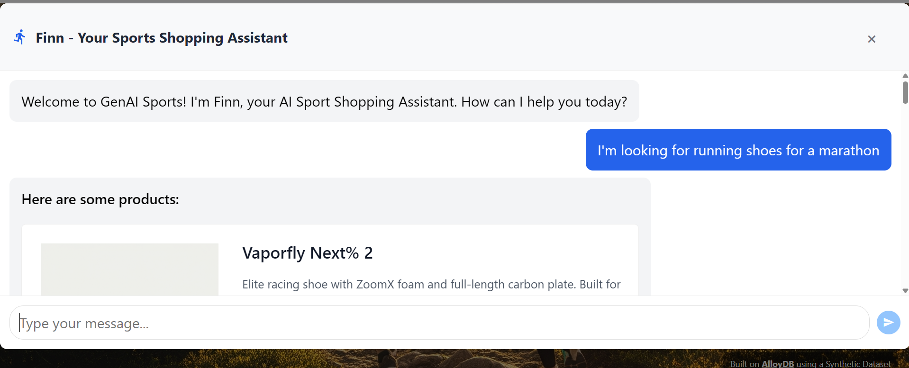
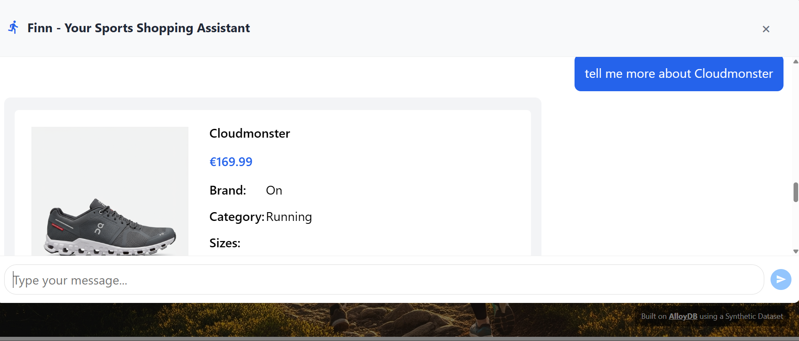
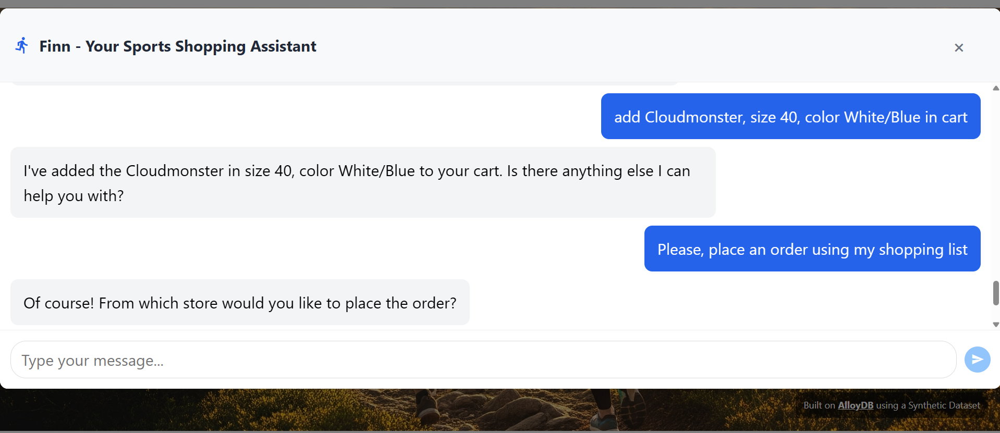

# 🏃 Finn - Your Sports Shopping Assistant

## Production Quality E-Commerce Sports Agent

## 🎯 Project Goal

This agent provides intelligent e-commerce capabilities for sports equipment, featuring product search, recommendations, inventory management, and order processing with AlloyDB database integration using MCP tools.


## 📹 Video Demonstration
[Walkthrough YouTube Video](https://youtu.be/GLdI4Azjh9o)

## 🏛️ High-Level Architecture

```
┌─────────────────────────────────────────────────────────────────────────────────┐
│                              USER INTERFACE LAYER                                │
│                                                                                   │
│  ┌─────────────────────────────────────────────────────────────────────────┐   │
│  │                    React Frontend (Vite + Tailwind)                      │   │
│  │  • Product Search UI      • Shopping Cart       • Order Management       │   │
│  │  • Store Locator          • User Authentication • Chat Interface         │   │
│  └──────────────────────────────────┬───────────────────────────────────────┘   │
│                                     │ HTTPS/REST API                            │
└─────────────────────────────────────┼───────────────────────────────────────────┘
                                      │
                                      ▼
┌─────────────────────────────────────────────────────────────────────────────────┐
│                           APPLICATION LAYER (Cloud Run)                          │
│                                                                                   │
│  ┌─────────────────────────────────────────────────────────────────────────┐   │
│  │                    FastAPI Backend Service (app.py)                      │   │
│  │  • REST API Endpoints     • CORS Middleware     • Session Management    │   │
│  │  • Image Serving (GCS)    • Request Routing     • Error Handling        │   │
│  └──────────────────────────────────┬───────────────────────────────────────┘   │
│                                     │                                            │
│                                     ▼                                            │
│  ┌─────────────────────────────────────────────────────────────────────────┐   │
│  │              Finn Agent (finn_agent.py) - Gemini 2.5 Flash              │   │
│  │  • Natural Language Processing    • Context Management                   │   │
│  │  • Intent Recognition             • Response Generation                  │   │
│  │  • Tool Orchestration             • Session State Handling               │   │
│  └──────────────────────────────────┬───────────────────────────────────────┘   │
│                                     │ ADK (Agent Development Kit)               │
└─────────────────────────────────────┼───────────────────────────────────────────┘
                                      │
                                      ▼
┌─────────────────────────────────────────────────────────────────────────────────┐
│                        INTEGRATION LAYER (Cloud Run)                             │
│                                                                                   │
│  ┌─────────────────────────────────────────────────────────────────────────┐   │
│  │              MCP Toolbox Server (Model Context Protocol)                 │   │
│  │  • Database Tool Definitions (tools.yaml)                                │   │
│  │  • Google Sign-In Authentication                                         │   │
│  │  • SQL Query Execution & Management                                      │   │
│  │  • Vector Similarity Search                                              │   │
│  │  • Natural Language to SQL (AlloyDB AI)                                  │   │
│  └──────────────────────────────────┬───────────────────────────────────────┘   │
│                                     │ AlloyDB Auth Proxy                        │
└─────────────────────────────────────┼───────────────────────────────────────────┘
                                      │
                                      ▼
┌─────────────────────────────────────────────────────────────────────────────────┐
│                            DATA LAYER (AlloyDB)                                  │
│                                                                                   │
│  ┌─────────────────────────────────────────────────────────────────────────┐   │
│  │                    AlloyDB PostgreSQL Database                           │   │
│  │                                                                           │   │
│  │  ┌──────────────┐  ┌──────────────┐  ┌──────────────┐  ┌────────────┐ │   │
│  │  │   Products   │  │    Users     │  │   Stores     │  │   Orders   │ │   │
│  │  │  • product_id│  │  • user_id   │  │  • store_id  │  │ • order_id │ │   │
│  │  │  • name      │  │  • email     │  │  • name      │  │ • user_id  │ │   │
│  │  │  • brand     │  │  • address   │  │  • location  │  │ • store_id │ │   │
│  │  │  • category  │  │  • location  │  │  (PostGIS)   │  │ • status   │ │   │
│  │  │  • embedding │  │  (PostGIS)   │  └──────────────┘  └────────────┘ │   │
│  │  │  (vector)    │  └──────────────┘                                    │   │
│  │  └──────────────┘                                                       │   │
│  │                                                                           │   │
│  │  ┌──────────────┐  ┌──────────────┐  ┌──────────────┐  ┌────────────┐ │   │
│  │  │  Variants    │  │ Shopping     │  │  Delivery    │  │  Policies  │ │   │
│  │  │  • size      │  │  Lists       │  │  Methods     │  │  • rules   │ │   │
│  │  │  • color     │  │  • items     │  │  • cost      │  │  • terms   │ │   │
│  │  │  • price     │  │  • quantity  │  │  • time      │  │            │ │   │
│  │  └──────────────┘  └──────────────┘  └──────────────┘  └────────────┘ │   │
│  │                                                                           │   │
│  │  AI Features:                                                             │   │
│  │  • Vector Embeddings (text-embedding-005)                                │   │
│  │  • Semantic Search (Cosine Similarity)                                   │   │
│  │  • Geospatial Queries (PostGIS)                                          │   │
│  │  • Natural Language SQL (AlloyDB AI)                                     │   │
│  └───────────────────────────────────────────────────────────────────────────┘ │
└─────────────────────────────────────────────────────────────────────────────────┘

┌─────────────────────────────────────────────────────────────────────────────────┐
│                          EXTERNAL SERVICES                                       │
│                                                                                   │
│  ┌──────────────────┐  ┌──────────────────┐  ┌──────────────────────────────┐ │
│  │  Google Cloud    │  │  Vertex AI       │  │  Google Cloud Storage        │ │
│  │  Storage (GCS)   │  │  • Gemini 2.5    │  │  • Recipe Images             │ │
│  │  • Product Images│  │  • Embeddings    │  │  • Static Assets             │ │
│  └──────────────────┘  └──────────────────┘  └──────────────────────────────┘ │
└─────────────────────────────────────────────────────────────────────────────────┘

DATA FLOW:
──────────
1. User Query → Frontend → Backend API → Finn Agent
2. Finn Agent → Analyzes Intent → Selects Appropriate MCP Tool
3. MCP Toolbox → Executes SQL/Vector Search → AlloyDB
4. AlloyDB → Returns Results → MCP Toolbox → Finn Agent
5. Finn Agent → Formats Response → Backend → Frontend → User

KEY TECHNOLOGIES:
─────────────────
• Frontend: React 18, Vite, Tailwind CSS, Axios
• Backend: FastAPI, Python 3.11+, Uvicorn
• AI Agent: Google ADK, Gemini 2.5 Flash, LangChain
• Database: AlloyDB PostgreSQL with AI extensions
• MCP: Model Context Protocol (Toolbox Server)
• Infrastructure: Google Cloud Run, VPC, Cloud Build
• Authentication: Google Sign-In (OAuth 2.0)
• Vector Search: text-embedding-005 embeddings
• Geospatial: PostGIS for location-based queries
```

## 📹 Video Demonstration
[Walkthrough YouTube Video](https://www.youtube.com/)

## 🏗️ Architecture Overview

### Agent Capabilities
- Product search and discovery
- Personalized recommendations
- Inventory management
- Order processing
- Database operations via MCP

### Key Components
1. **Sports Agent** - Main orchestrator
2. **MCP Database Tools** - AlloyDB integration
3. **Product Search** - Intelligent search
4. **Recommendation Engine** - Personalized suggestions
5. **Order Manager** - Transaction processing

---

## 📋 Implementation Steps

### Step 1: Database Setup
- Set up AlloyDB instance
- Create database schema
- Load product data
- Configure connections

### Step 2: MCP Tools Development
- Create database MCP tools
- Implement CRUD operations
- Add search functionality
- Configure transactions

### Step 3: Agent Development
- Create sports agent
- Integrate MCP tools
- Define product workflows
- Configure recommendations

### Step 4: E-Commerce Features
- Product search implementation
- Recommendation algorithm
- Shopping cart management
- Order processing

### Step 5: Deployment
- Deploy to Cloud Run
- Configure AlloyDB connection
- Set up monitoring
- Test production

---

## 🚀 Usage Examples

### Example 1: Product Search
**Input:** "Find running shoes under $100"

**Agent Actions:**
1. Queries database via MCP
2. Filters by price
3. Ranks by relevance
4. Retrieves product details
5. Returns results

**Output:** List of matching products with details

### Example 2: Personalized Recommendations
**Input:** "Recommend products based on my purchase history"

**Agent Actions:**
1. Retrieves user history
2. Analyzes preferences
3. Finds similar products
4. Ranks recommendations
5. Returns personalized list

**Output:** Curated product recommendations

### Example 3: Order Processing
**Input:** "Place order for product ID 12345"

**Agent Actions:**
1. Validates product availability
2. Checks inventory
3. Processes payment
4. Creates order record
5. Updates inventory
6. Sends confirmation

**Output:** Order confirmation with details

---

## 🔑 Key Features

### Product Management
- Comprehensive search
- Advanced filtering
- Category browsing
- Product details

### Recommendations
- Collaborative filtering
- Content-based recommendations
- Purchase history analysis
- Trending products

### Inventory Management
- Real-time stock tracking
- Low stock alerts
- Automatic reordering
- Inventory reports

### Order Processing
- Cart management
- Checkout workflow
- Payment processing
- Order tracking

### Database Integration
- MCP tools for database
- Efficient queries
- Transaction management
- Data consistency

---

## 💡 Best Practices

- Efficient database queries
- Proper indexing
- Transaction handling
- Error recovery
- Caching strategies
- Security measures

---

## 🔗 Resources

- Codelab: https://codelabs.developers.google.com/codelabs/sports-agent-adk-mcp-alloydb
- Code: https://github.com/mtoscano84/sports-agent-adk-mcp-alloydb
- AlloyDB: https://cloud.google.com/alloydb/docs

---

## ✅ Completion Checklist

- [ ] AlloyDB setup complete
- [ ] MCP database tools implemented
- [ ] Sports agent created
- [ ] Product search working
- [ ] Recommendations functional
- [ ] Inventory management operational
- [ ] Order processing complete
- [ ] Testing completed
- [ ] Deployed to production
- [ ] Video walkthrough recorded

---

## 📸 Project Output







---

**Agent:** 5 of 5
**Complexity:** High
**Points:** 100
